\begin{center}
\includegraphics[height=0.58\textheight,keepaspectratio]{assets/images/image_a_inserer.png}
\end{center}

\newpage

# Résumé {-}

Le présent document décrit le backend du projet **GesPharmacie / PHARMA 221**, une API web conçue pour gérer les opérations essentielles d’une pharmacie: authentification, gestion des clients, gestion des fournisseurs, gestion du stock de médicaments et enregistrement des ventes. Le périmètre documentaire retenu est volontairement limité au backend, car c’est la partie effectivement disponible et vérifiable dans le dépôt de travail au moment de la rédaction.

L’analyse du code montre une base technique cohérente reposant sur **Express 4**, **TypeScript**, **Prisma ORM** et **PostgreSQL**. L’architecture est modulaire. Chaque domaine fonctionnel suit une chaîne explicite allant de la route HTTP jusqu’au dépôt de persistance, avec un passage par des contrôleurs, des services et des validateurs. Cette organisation facilite la lisibilité du code, l’isolation des règles métier et la mise en place de tests unitaires ciblés.

Le projet adopte également des pratiques de qualité logicielle déjà significatives: tests unitaires exécutables, génération de documentation OpenAPI, pipeline GitHub Actions, préparation au déploiement Render et exécution locale via Docker Compose. Le mémoire met cependant en évidence certaines limites actuelles, notamment une authentification encore incomplète du point de vue métier, l’absence d’une table d’utilisateurs persistante et une protection JWT qui ne couvre pas encore l’ensemble des routes fonctionnelles.

Ce mémoire poursuit donc un double objectif. D’une part, il explicite de manière méthodique ce qui est déjà mis en œuvre dans le backend. D’autre part, il fournit une lecture critique de la solution afin d’identifier les consolidations nécessaires pour un passage vers un niveau de maturité plus élevé.

\newpage

# Introduction générale

Le besoin de numérisation des activités pharmaceutiques répond à plusieurs contraintes concrètes: fiabilité des données de stock, rapidité de traitement des opérations de vente, traçabilité des mouvements et sécurisation des informations métier. Dans une pharmacie, l’erreur n’a pas seulement un coût organisationnel; elle peut également produire des conséquences directes sur la qualité du service rendu au patient ou au client.

Dans ce contexte, le backend GesPharmacie a pour vocation de fournir une base d’API claire, testable et extensible. L’objectif n’est pas uniquement de stocker des informations. Il s’agit surtout de centraliser des règles métier essentielles, comme l’interdiction de vendre un médicament expiré, l’impossibilité de supprimer une entité encore référencée par des opérations, ou encore le recalcul systématique du montant total d’une vente.

L’approche adoptée dans ce mémoire est démonstrative. Chaque affirmation repose sur un élément vérifiable du dépôt: structure des dossiers, configuration d’environnement, schéma Prisma, code des services, tests unitaires et pipeline d’intégration continue. La rédaction cherche donc moins à produire un discours théorique qu’à exposer une lecture rigoureuse de la solution effectivement implémentée.

## Objet du mémoire

Ce mémoire porte exclusivement sur le backend du projet. Il couvre:

- la logique fonctionnelle observable dans le code;
- l’architecture logicielle retenue;
- la modélisation des données;
- les mécanismes de validation, de sécurité et de robustesse;
- la documentation technique disponible;
- le déploiement et la qualité logicielle.

## Référentiel d’analyse

L’analyse a été menée directement sur le dépôt local du projet. La base de travail observable au moment de la rédaction correspond au commit `d188487`, positionné sur la branche `feature/prisma-seed-data`.

Les éléments suivants ont été vérifiés localement pendant la rédaction:

- compilation TypeScript du backend;
- exécution de la suite de tests unitaires;
- lecture des fichiers de configuration, du schéma Prisma et du workflow CI;
- inspection des modules métier et des middlewares.

# Objectif du projet

## Ce que le projet doit résoudre

Le projet **GesPharmacie / PHARMA 221** a pour objectif de construire le backend d’une application de gestion de pharmacie. En langage simple, cela signifie que l’application doit être capable d’enregistrer les clients, les fournisseurs, les médicaments et les ventes, tout en empêchant les incohérences métier les plus dangereuses.

Le problème réel n’est donc pas seulement “stocker des données”. Le vrai besoin consiste à faire respecter des règles. Par exemple:

- un médicament doit être rattaché à un fournisseur valide;
- une vente ne peut pas être enregistrée si le client n’existe pas;
- un médicament expiré ne doit pas être vendu;
- un stock insuffisant doit bloquer l’opération;
- certaines suppressions doivent être refusées pour ne pas casser l’historique.

## Ce que le backend doit produire

Le backend doit fournir un résultat concret, lisible et réutilisable:

- une API REST disponible sous `/api/v1`;
- un point de santé pour vérifier si le service fonctionne;
- un module d’authentification minimale par JWT;
- un module `clients`;
- un module `fournisseurs`;
- un module `medicaments`;
- un module `ventes`;
- une documentation Swagger/OpenAPI;
- une base PostgreSQL pilotée par Prisma;
- une structure de code assez claire pour qu’un autre développeur puisse refaire l’application.

## Pourquoi le mémoire se concentre sur le backend

Le dépôt observé contient surtout la partie backend. C’est donc cette partie qui sert de base à l’analyse et à la reconstruction. Le mémoire ne cherche pas à raconter un projet imaginaire. Il montre comment le backend a été construit, pourquoi cette architecture a été choisie, et comment un lecteur peut refaire chaque module en suivant les étapes dans le bon ordre.

# Partie 1. Initialisation du projet

## Préparer l’environnement avant d’écrire le premier module

Avant de parler des modules, il faut d’abord préparer le terrain. Si cette étape est mal faite, tout le reste devient confus. Pour refaire proprement ce backend, il faut installer:

1. **Node.js** en version `>=20`, car c’est le runtime attendu par le projet.
2. **npm**, pour installer les dépendances et lancer les scripts.
3. **PostgreSQL**, car les données sont stockées dans une base relationnelle.
4. **VS Code** ou un éditeur équivalent, pour garder une lecture claire du projet.

Quand on repart de zéro, la logique d’installation la plus simple est la suivante:

1. créer le projet avec `npm init -y`;
2. installer les dépendances d’exécution avec `npm install express cors helmet dotenv zod jsonwebtoken pino pino-pretty swagger-ui-express @prisma/client`;
3. installer les dépendances de développement avec `npm install -D typescript tsx prisma vitest @types/node @types/express @types/jsonwebtoken @types/swagger-ui-express @types/cors @types/supertest`;
4. initialiser Prisma, créer le schéma et préparer les migrations;
5. seulement après cela, commencer l’écriture du code applicatif.

La capture suivante montre la base réelle de configuration du projet dans `package.json`. On y voit à la fois le runtime, les scripts d’exécution et les dépendances qui rendent possible toute l’application.

{ width=100% }

La lecture de ce fichier permet déjà de comprendre plusieurs décisions:

- `express`, `cors` et `helmet` servent à construire l’API HTTP;
- `zod` sert à valider les entrées;
- `jsonwebtoken` sert au module d’authentification;
- `@prisma/client` et `prisma` servent à la couche base de données;
- `tsx` sert au développement local;
- `typescript` sert à typer le projet;
- `vitest` sert à vérifier le comportement.

## Organiser le travail dès le début

Un bon backend ne se construit pas en ajoutant des fichiers au hasard. Le dépôt montre une progression par sprints. Cette organisation a un intérêt très pédagogique, car elle permet de construire une chose à la fois.

La progression observée est la suivante:

- **Sprint 1**: modélisation du domaine avec Prisma;
- **Sprint 2**: fournisseurs;
- **Sprint 3**: médicaments;
- **Sprint 4**: clients;
- **Sprint 5**: ventes.

En parallèle, la stratégie Git sépare les branches de référence et les branches de travail. Cette discipline est utile, car elle évite de mélanger l’expérimentation et la version stable.

## Créer le socle HTTP du projet

Une fois les dépendances installées, la première vraie étape de code consiste à monter le socle HTTP. Il faut un fichier qui construit l’application et un fichier qui lance réellement le serveur.

{ width=100% }

{ width=100% }

Le rôle des deux fichiers est très simple:

- `app.ts` assemble les middlewares, la documentation Swagger, la route `/pdf`, le routeur principal et la gestion des erreurs;
- `server.ts` se charge de démarrer le service, d’ouvrir le port et de connecter la base.

Ce découpage est important. Il permet de comprendre qu’un serveur backend n’est pas “un seul gros fichier”. On sépare la définition de l’application de son lancement réel.

## Mettre en place les fondations techniques avant les modules

Avant de coder `auth`, `clients` ou `ventes`, il faut mettre en place plusieurs éléments partagés.

### Validation de l’environnement

Le projet valide les variables critiques dès le démarrage.

{ width=100% }

Cette étape évite qu’un backend démarre avec une base absente, un secret JWT manquant ou un port invalide.

### Journalisation

Le logger est installé très tôt pour rendre les messages d’exécution lisibles.

{ width=100% }

### Accès à la base de données

Prisma et la connexion base sont préparés avant les modules métier.

{ width=100% }

{ width=100% }

### Outils transverses

Le backend prépare aussi dès le début les éléments qui seront réutilisés partout:

{ width=100% }

{ width=100% }

{ width=100% }

L’idée est simple: ces briques ne sont pas des modules métier, mais elles rendent possible une implémentation propre des modules métier.

## Préparer les portes d’entrée avant les fonctionnalités

Avant de créer un vrai module, il faut préparer l’entrée du backend: le routage principal et la documentation.

{ width=100% }

{ width=100% }

{ width=100% }

Cette étape sert à répondre à trois questions:

- où les requêtes arrivent-elles?
- comment les modules sont-ils branchés?
- comment l’API sera-t-elle testée et lue ensuite?

Tant que ce socle n’existe pas, il est inutile de détailler un module métier. Il faut donc toujours initialiser le projet avant d’entrer dans `auth`, `clients`, `fournisseurs`, `medicaments` ou `ventes`.

# Partie 2. Étude détaillée de l’architecture choisie

## Architecture retenue

Le backend de GesPharmacie adopte une architecture **monolithique modulaire en couches**. En langage simple, cela veut dire:

- un seul backend est déployé;
- ce backend est divisé en modules métier;
- chaque module suit les mêmes couches internes;
- la base relationnelle est centralisée dans PostgreSQL via Prisma.

Ce choix est pertinent pour ce projet pour plusieurs raisons:

- le périmètre fonctionnel est suffisamment concentré pour ne pas imposer des microservices;
- le code doit rester lisible pour une soutenance;
- les règles métier doivent être séparées des détails HTTP;
- le déploiement doit rester simple sur Render.

## Pourquoi cette architecture est adaptée

L’architecture retenue répond à deux besoins en même temps:

1. **faire fonctionner l’application**;
2. **permettre à quelqu’un d’autre de la refaire**.

Si tout le code était mélangé dans les routes, le projet pourrait peut-être fonctionner, mais il serait très difficile à expliquer et à maintenir. Ici, chaque couche porte une responsabilité claire:

| Couche | Ce qu’elle fait |
|---|---|
| Route | reçoit l’URL et branche les middlewares |
| Controller | construit la réponse HTTP |
| Service | décide de la règle métier |
| Repository | parle à Prisma et à la base |
| Base de données | stocke les données et applique les relations |

## Capture directe de l’architecture source

L’arborescence réelle du dossier `src` confirme que cette architecture n’est pas seulement théorique.

L’ordre recommandé de lecture est le suivant:

1. `src/config`
2. `src/common`
3. `src/middlewares`
4. `src/routes`
5. `src/container`
6. `src/modules`

Ce chemin de lecture permet d’abord de comprendre le cadre général, puis seulement ensuite les détails des modules.

## Comment une requête traverse l’application

Le flux complet peut être résumé ainsi: **Requête HTTP -> route -> controller -> service -> repository -> Prisma -> PostgreSQL**.

Ce parcours est visible directement dans le code réel:

{ width=100% }

{ width=100% }

{ width=100% }

Pour un lecteur débutant, l’idée centrale est la suivante:

- la route ne décide pas de la logique métier;
- le service ne construit pas la réponse HTTP;
- le repository n’invente pas la règle fonctionnelle;
- chaque couche a son rôle, et c’est ce qui rend le projet compréhensible.

## Ce que fait chaque dossier principal

### `src/config`

Ce dossier centralise l’environnement, la base de données et la journalisation. Il sert à sécuriser le démarrage.

### `src/common`

Ce dossier porte les interfaces, messages, erreurs et utilitaires réutilisés dans plusieurs modules.

{ width=100% }

### `src/middlewares`

Ce dossier contient la validation, la sécurité et le traitement centralisé des erreurs.

{ width=100% }

### `src/infrastructure`

Ce dossier contient les composants techniques bas niveau, notamment le client Prisma et la classe de base des repositories.

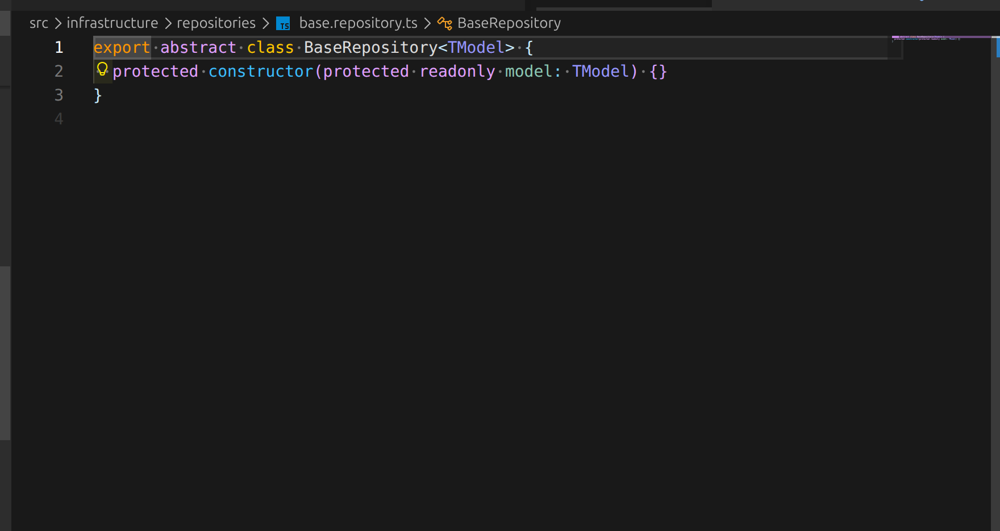{ width=100% }

### `src/modules`

C’est ici que se trouve le vrai métier. Chaque module possède son validateur, ses routes, son contrôleur, son service et son dépôt.

## Ordre de reconstruction à respecter

Pour refaire correctement le projet, il faut respecter cet ordre:

1. définir le besoin métier;
2. préparer l’environnement;
3. monter le socle HTTP;
4. préparer Prisma et la base;
5. installer les middlewares communs;
6. créer les modules un par un;
7. raccorder les modules au routeur principal;
8. documenter, tester et déployer.

Le point pédagogique le plus important est le suivant: **on ne commence pas par le module `ventes`**. On commence par les fondations, puis par les modules les plus simples, et seulement ensuite par les modules les plus sensibles.

# Partie 3. Étude détaillée de chaque module

## Logique générale de construction d’un module

Chaque module du projet suit volontairement la même mécanique. Cette régularité n’est pas un détail de style: elle permet à un lecteur débutant de refaire le projet sans se perdre. Pour bien comprendre cette mécanique, il faut distinguer deux ordres.

### Ordre conseillé pour **construire** un module

1. définir clairement ce que le module doit accomplir;
2. installer les dépendances utiles au module;
3. écrire le **validateur**;
4. écrire les **routes**;
5. écrire le **controller**;
6. écrire le **service**;
7. écrire le **repository**;
8. assembler le tout dans le **container** puis raccorder le module;
9. vérifier le comportement dans **Swagger**.

### Ordre conseillé pour **lire** un module

1. commencer par l’objectif du module;
2. regarder les **routes** pour voir les entrées;
3. regarder le **controller** pour voir la forme des réponses;
4. regarder le **service** pour voir les règles métier;
5. regarder le **repository** pour voir l’accès aux données;
6. revenir au **validateur** pour comprendre la forme précise des entrées;
7. terminer par le **container** puis le test dans **Swagger**.

Cette distinction est importante: on ne construit pas toujours dans le même ordre qu’on lit, mais dans ce mémoire, l’explication suit un ordre pédagogique stable pour qu’un autre développeur puisse refaire chaque module pas à pas.

## Module d’authentification

### Ce que ce module doit faire

Le module `auth` doit permettre:

- de recevoir un email et un mot de passe;
- de vérifier que la demande de connexion est bien formée;
- de fabriquer un jeton JWT;
- de relire l’utilisateur courant via `/me`.

### Dépendances principalement utilisées

Pour reconstruire ce module, les dépendances essentielles sont:

- `express` pour les routes et le controller;
- `zod` pour valider la demande de connexion;
- `jsonwebtoken` pour fabriquer le JWT.

Commande d’installation minimale: `npm install express zod jsonwebtoken`.

### Étape 1. Valider les entrées du module

Le validateur impose la forme minimale de la connexion: email correct et mot de passe assez long.

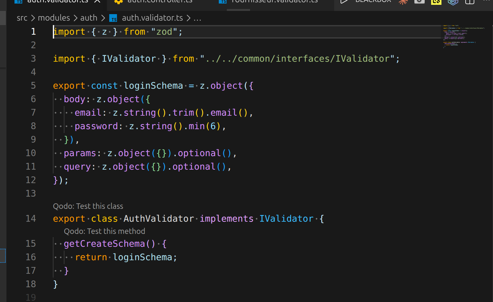{ width=100% }

Cette étape est importante, car elle évite de transmettre au service des données vides ou mal structurées.

### Étape 2. Déclarer les routes du module

Les routes exposent les deux entrées du module: connexion et lecture de l’utilisateur courant.

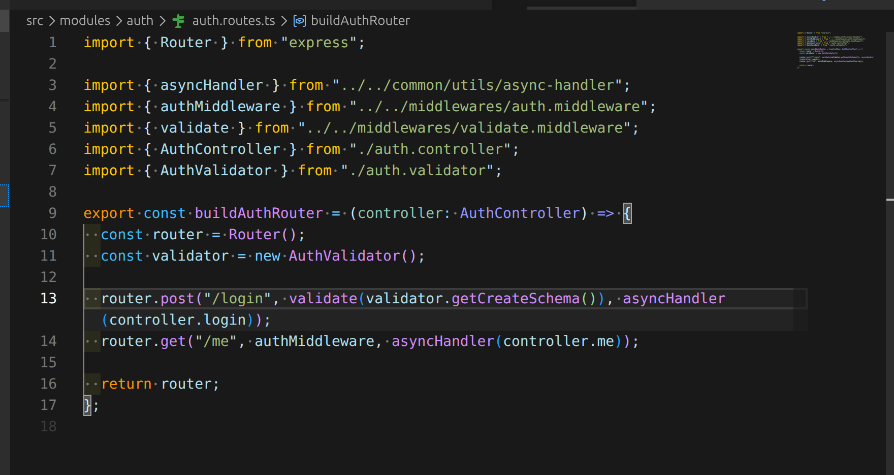{ width=100% }

La route ne fait pas la logique de connexion. Elle branche seulement le validateur, le contrôleur et le middleware d’authentification quand c’est nécessaire.

### Étape 3. Construire le contrôleur

Le contrôleur transforme le résultat du service en réponse HTTP.

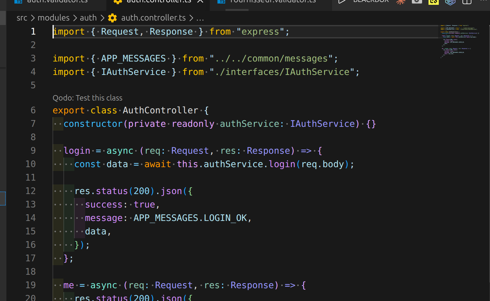{ width=100% }

Cette couche permet d’obtenir une réponse homogène avec `success`, `message` et `data`.

### Étape 4. Écrire le service

Le service porte la logique de connexion.

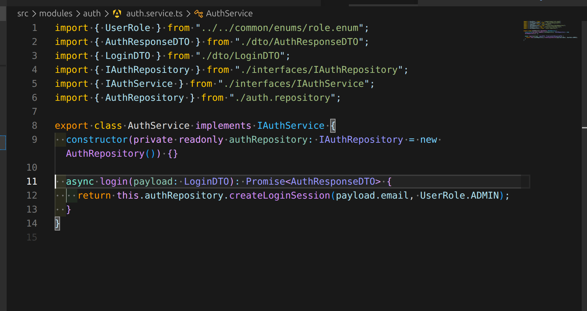{ width=100% }

Le service reçoit la demande, décide quoi faire et demande ensuite au repository de produire le jeton.

### Étape 5. Écrire le repository

Dans ce module, le repository a un rôle particulier: il fabrique le JWT.

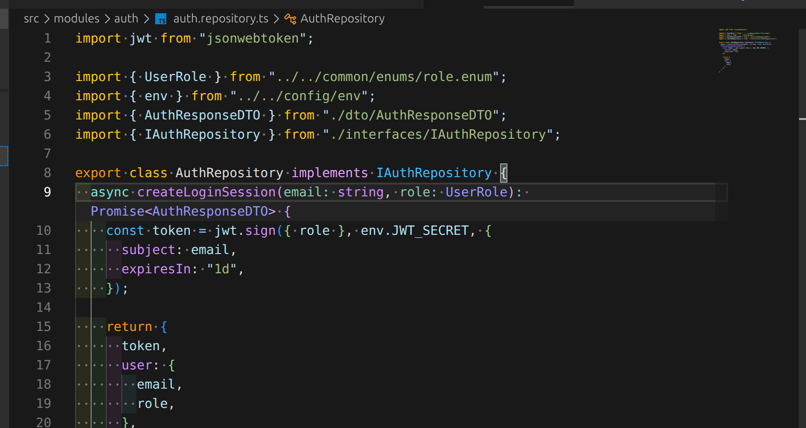{ width=100% }

La ligne `jwt.sign(...)` signifie que le backend crée un jeton signé à partir d’informations minimales. Ce jeton pourra ensuite être présenté au backend pour prouver l’identité du client.

### Étape 6. Assembler le module

Le container relie le repository, le service, le controller et les routes. Une fois cela fait, le module peut être branché au backend et devenir réellement utilisable.

{ width=100% }

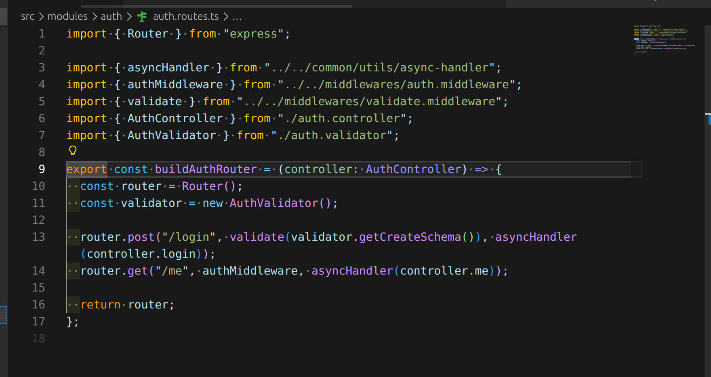{ width=100% }

À ce stade, le lecteur doit comprendre qu’un module n’est pas seulement une collection de fichiers: c’est un enchaînement complet, depuis la validation de l’entrée jusqu’au branchement dans l’application.

### Étape 7. Vérifier le module auth dans Swagger

Une fois le module branché, il faut vérifier qu’il apparaît bien dans la documentation exposée par l’API et que ses routes sont testables.

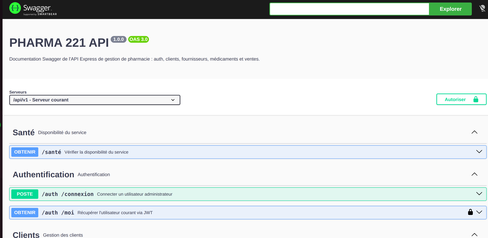{ width=100% }

Le test attendu à ce stade est simple:

- vérifier que les routes `auth` sont visibles;
- envoyer une demande de connexion cohérente;
- contrôler que le backend renvoie bien un jeton ou une erreur claire.

### Ce qu’il faut retenir

Le module `auth` est une porte d’entrée technique. Il est crédible, mais il reste limité car il ne repose pas encore sur une table utilisateur persistante.

## Module clients

### Ce que ce module doit faire

Le module `clients` doit permettre:

- de créer un client;
- de lister les clients;
- de consulter un client précis;
- de mettre à jour un client;
- de supprimer un client si cette suppression reste compatible avec l’historique des ventes.

### Dépendances principalement utilisées

Les dépendances principales sont:

- `express` pour exposer les endpoints;
- `zod` pour valider les entrées;
- `@prisma/client` pour accéder aux données.

Commande d’installation minimale: `npm install express zod @prisma/client`.

Si le schéma Prisma vient d’être modifié, il faut aussi régénérer le client avec `npx prisma generate`.

### Étape 1. Définir les données d’entrée

Le validateur décrit les champs attendus pour la création, la lecture par identifiant et la mise à jour.

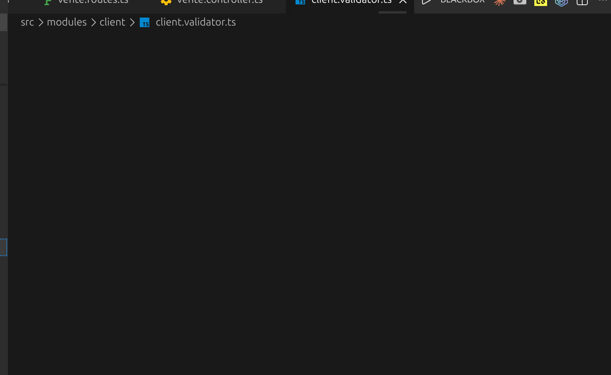{ width=100% }

Le rôle de ce fichier est de dire clairement ce qu’un client doit contenir avant même d’atteindre la logique métier.

### Étape 2. Déclarer les routes

Les routes disent quelles URLs déclenchent quelles actions.

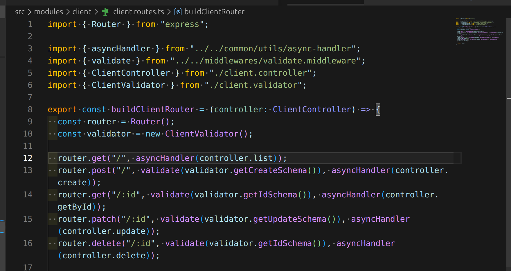{ width=100% }

À ce niveau, la logique est simple: une URL arrive, la validation s’exécute, puis le contrôleur est appelé.

### Étape 3. Construire le contrôleur

Le contrôleur formate la réponse.

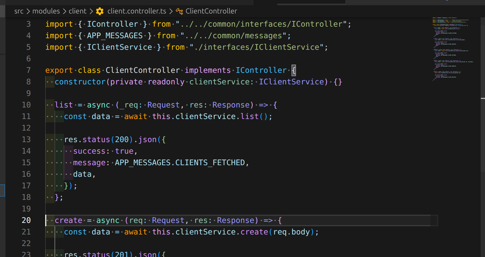{ width=100% }

Le contrôleur ne décide pas si un email existe déjà. Il ne fait qu’appeler le service et renvoyer un résultat HTTP cohérent.

### Étape 4. Écrire le service

C’est ici que le module commence réellement à “réfléchir”.

{ width=100% }

{ width=100% }

{ width=100% }

Le service pose deux règles fortes:

- l’email doit rester unique;
- un client lié à des ventes ne doit pas être supprimé librement.

### Étape 5. Écrire le repository

Le repository prépare les accès Prisma.

{ width=100% }

{ width=100% }

Le repository ne décide pas si la suppression est légitime. Il exécute seulement les accès à la base demandés par le service.

### Étape 6. Assembler le module puis le raccorder au backend

Quand validator, routes, controller, service et repository sont prêts, il faut les relier dans le container du module.

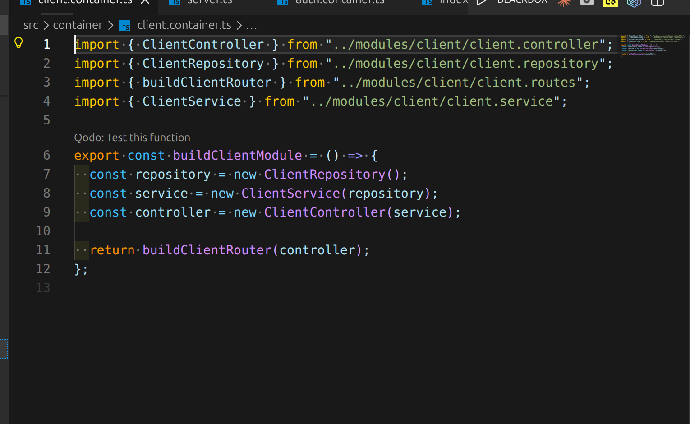{ width=100% }

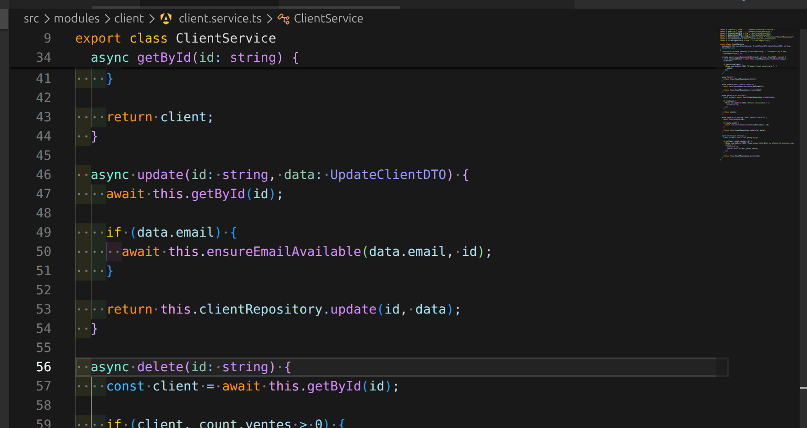{ width=100% }

Cette étape est indispensable: sans container, le module existe dans les fichiers, mais il n’est pas encore branché dans l’application.

### Étape 7. Vérifier le module clients dans Swagger

Après assemblage, il faut vérifier dans Swagger que les routes clients sont bien publiées et qu’un test de création ou de lecture peut être lancé.

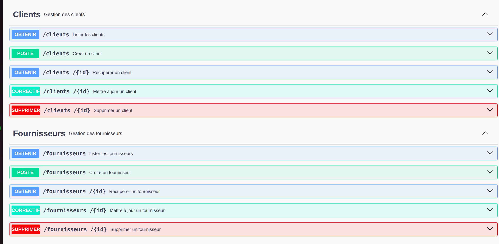{ width=100% }

Le contrôle attendu à ce niveau est le suivant:

- créer un client avec des données valides;
- relire la liste des clients;
- vérifier qu’un mauvais identifiant ou un email déjà utilisé produit une erreur claire.

Ce module montre bien la logique du projet: on ne fait pas seulement un CRUD. On protège aussi la cohérence du domaine.

## Module fournisseurs

### Ce que ce module doit faire

Le module `fournisseurs` sert à gérer les sources d’approvisionnement. Il doit permettre d’enregistrer un fournisseur, de le modifier, de le consulter et de le supprimer seulement si cette suppression ne casse pas la relation avec les médicaments.

### Dépendances principalement utilisées

Les dépendances principales sont:

- `express`;
- `zod`;
- `@prisma/client`.

Commande d’installation minimale: `npm install express zod @prisma/client`.

Comme pour les autres modules connectés à la base, `npx prisma generate` doit être relancé si le schéma évolue.

### Étape 1. Définir les données d’entrée

Le validateur impose la forme des données fournisseur.

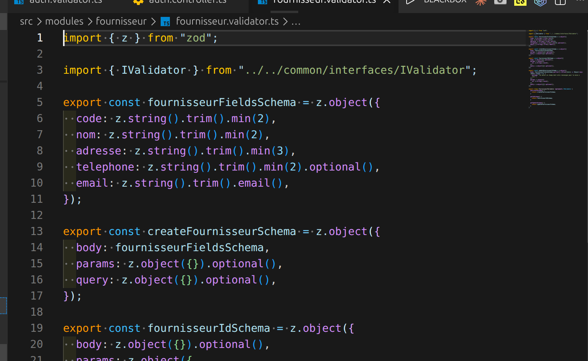{ width=100% }

Ce fichier est important, car il fixe les champs attendus très tôt: code, nom, adresse, téléphone et email.

### Étape 2. Déclarer les routes

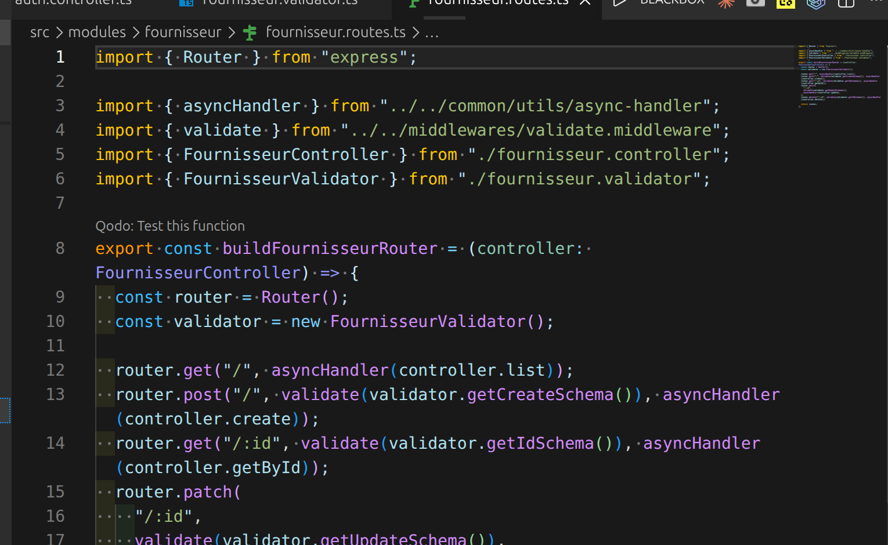{ width=100% }

On retrouve ici le même modèle que pour le module client: validation, puis passage au contrôleur.

### Étape 3. Construire le contrôleur

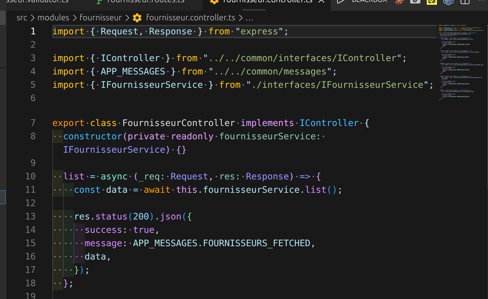{ width=100% }

Le contrôleur porte le contrat HTTP du module: codes de réponse, messages et données renvoyées.

### Étape 4. Écrire le service

Le service porte la vraie logique fournisseur.

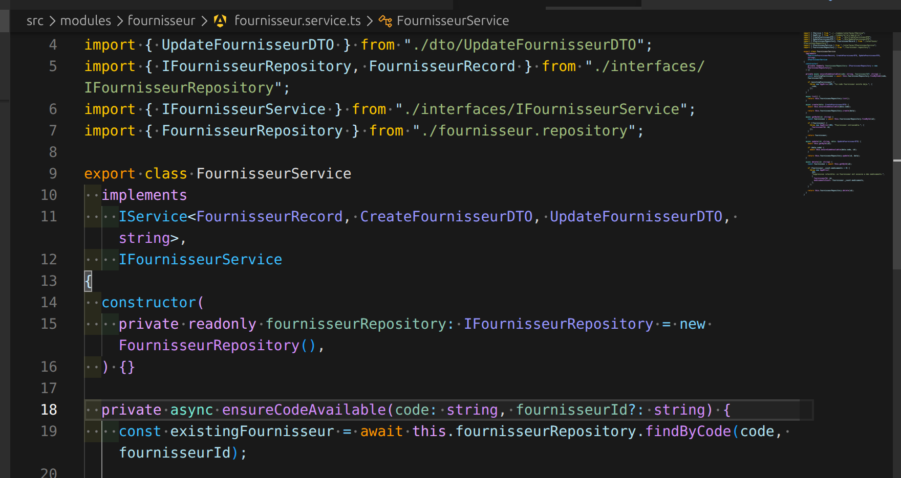{ width=100% }

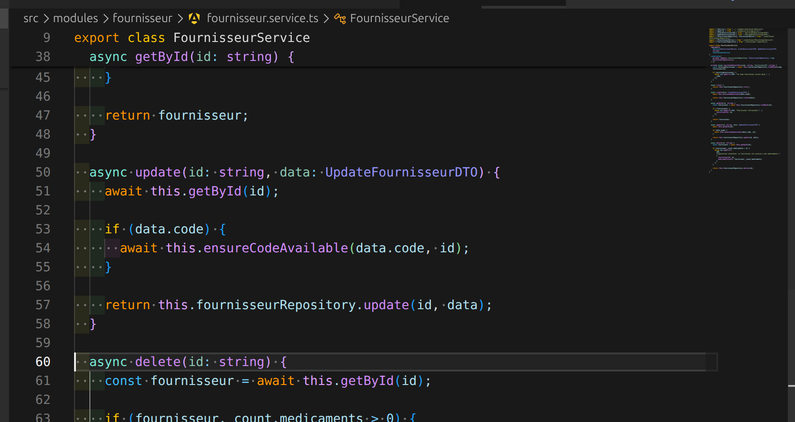{ width=100% }

Le service vérifie que le code fournisseur reste unique et qu’un fournisseur déjà relié à des médicaments n’est pas supprimé à la légère.

### Étape 5. Écrire le repository

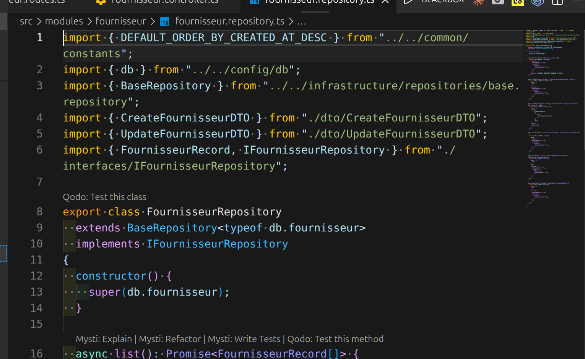{ width=100% }

Le repository liste, recherche, crée, met à jour et supprime les fournisseurs avec Prisma, sans prendre de décision métier autonome.

### Étape 6. Assembler le module puis le raccorder au backend

Le container fournisseur relie maintenant les briques déjà construites et fournit un routeur prêt à être branché dans l’application.

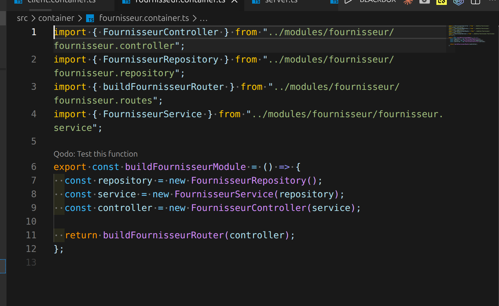{ width=100% }

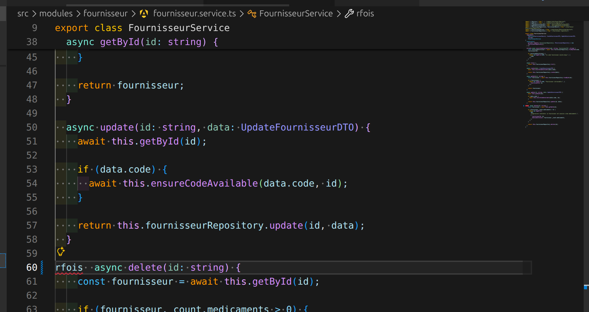{ width=100% }

Cette étape matérialise la bascule entre “le code existe” et “la fonctionnalité est réellement disponible”.

### Étape 7. Vérifier le module fournisseurs dans Swagger

Une fois le module raccordé, Swagger permet de tester l’entrée principale de création fournisseur avec une requête réelle.

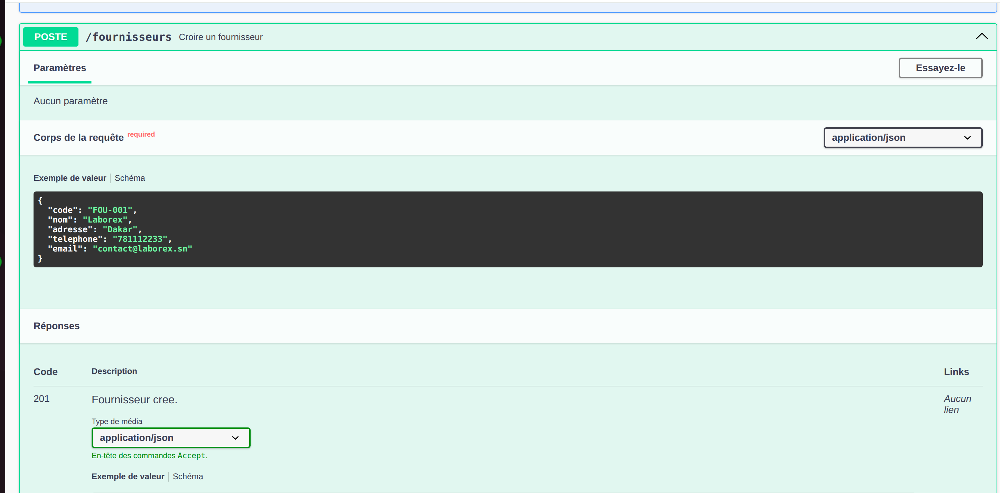{ width=100% }

Le contrôle attendu est simple:

- créer un fournisseur valide;
- relire le fournisseur créé;
- vérifier qu’un code déjà utilisé ou une suppression interdite remonte un message explicite.

L’idée centrale de ce module est simple: un fournisseur n’est pas un enregistrement décoratif. Il fait partie de la chaîne réelle d’approvisionnement.

## Module médicaments

### Ce que ce module doit faire

Le module `medicaments` sert à gérer le stock vendable. Il doit enregistrer un produit, vérifier qu’il est correctement défini et s’assurer qu’il reste cohérent avec le fournisseur, le prix, le stock et la date d’expiration.

### Dépendances principalement utilisées

Les dépendances principales sont:

- `express`;
- `zod`;
- `@prisma/client`.

Commande d’installation minimale: `npm install express zod @prisma/client`.

Si les modèles Prisma changent, il faut aussi régénérer le client via `npx prisma generate`.

### Étape 1. Définir les données d’entrée

Le validateur montre immédiatement la nature plus exigeante de ce module: prix, quantité, date d’expiration et identifiant fournisseur doivent tous être corrects.

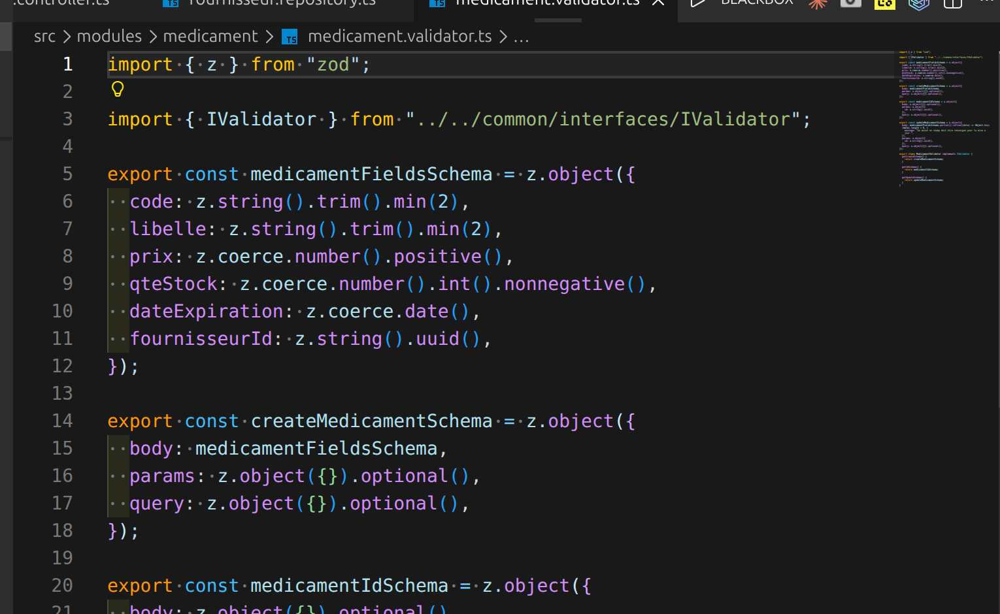{ width=100% }

### Étape 2. Déclarer les routes

{ width=100% }

Le module conserve la même logique d’entrée que les autres modules, ce qui maintient la cohérence globale du backend.

### Étape 3. Construire le contrôleur

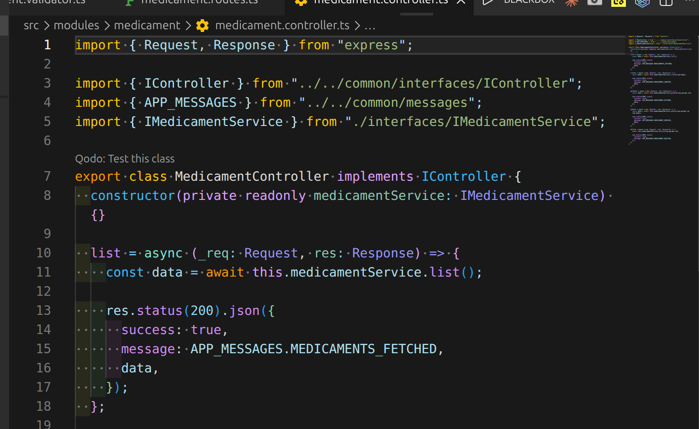{ width=100% }

Le contrôleur garde un rôle simple: renvoyer une réponse HTTP propre après exécution du service.

### Étape 4. Écrire le service

Le service du module médicaments porte des contrôles plus riches que ceux des modules précédents.

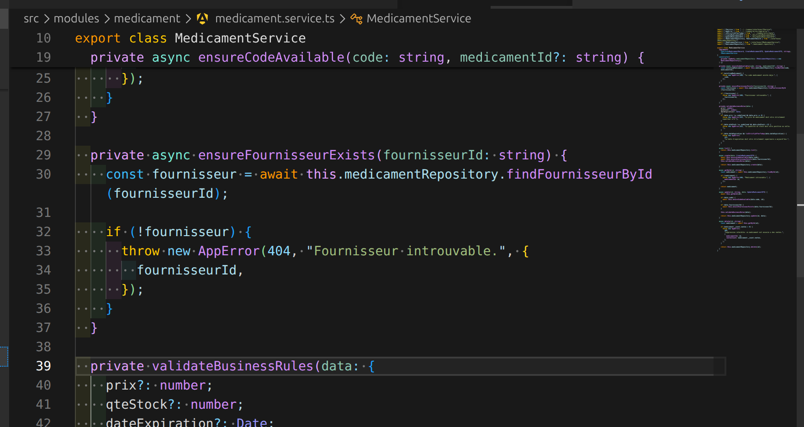{ width=100% }

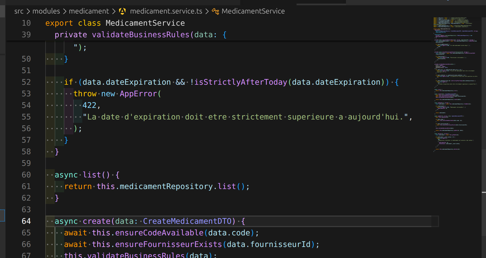{ width=100% }

Les vérifications essentielles sont:

- unicité du code médicament;
- existence réelle du fournisseur;
- validité du prix;
- validité de la quantité en stock;
- cohérence de la date d’expiration.

### Étape 5. Écrire le repository

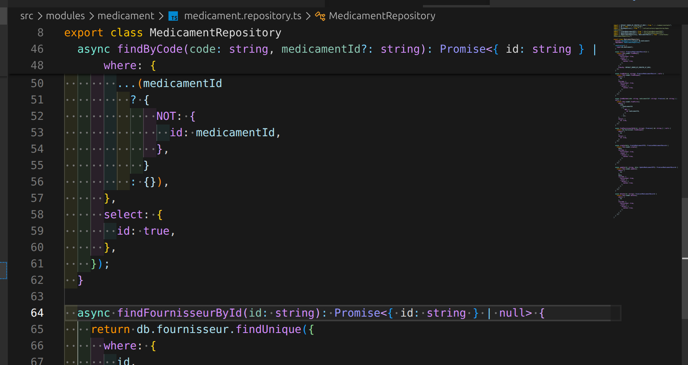{ width=100% }

Le repository du module médicaments communique avec Prisma pour lire et écrire les produits, mais les décisions métier continuent à vivre dans le service.

### Étape 6. Assembler le module puis le raccorder au backend

Le container du module médicaments assemble les classes déjà écrites et retourne le routeur final du module.

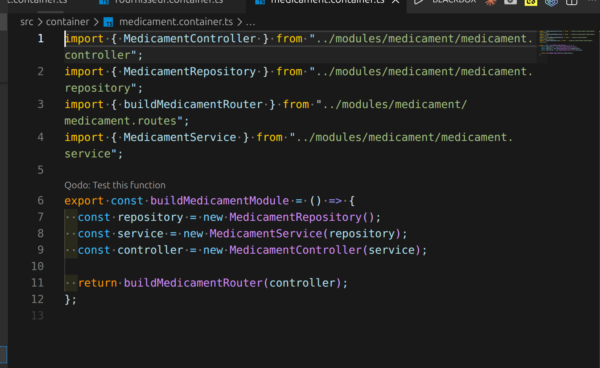{ width=100% }

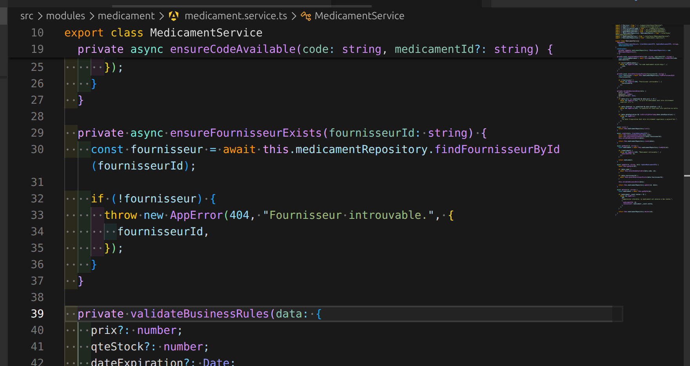{ width=100% }

Tant que cette étape n’est pas faite, le backend ne peut pas encore exposer proprement les routes du stock.

### Étape 7. Vérifier le module médicaments dans Swagger

Une fois branché, le module doit être testé avec une requête réelle de création de médicament.

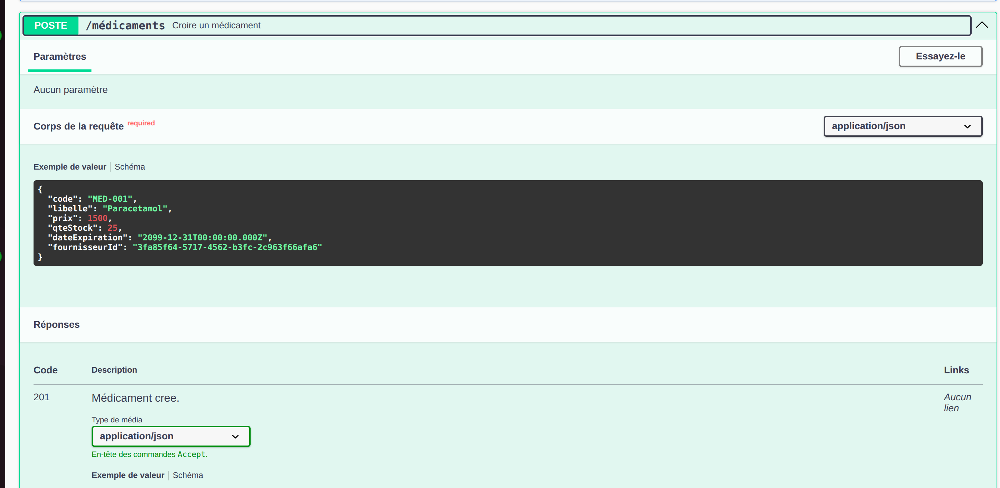{ width=100% }

Le lecteur doit vérifier ici:

- qu’un médicament valide peut être créé;
- qu’un fournisseur inexistant est refusé;
- qu’un prix, une quantité ou une date incohérente déclenche une erreur compréhensible.

Ce module est important, car il prépare directement le module `ventes`. Si les médicaments sont mal définis, les ventes ne peuvent plus être sûres.

## Module ventes

### Ce que ce module doit faire

Le module `ventes` est le module le plus critique. Il doit:

- recevoir un client et un médicament;
- contrôler la quantité demandée;
- vérifier le stock;
- vérifier la date d’expiration;
- calculer le montant;
- créer la vente et mettre à jour le stock dans une même opération cohérente.

### Dépendances principalement utilisées

Les dépendances principales sont:

- `express`;
- `zod`;
- `@prisma/client`.

Commande d’installation minimale: `npm install express zod @prisma/client`.

Comme la vente dépend du modèle de données et des transactions Prisma, `npx prisma generate` reste une étape utile après modification du schéma.

### Étape 1. Définir les données d’entrée

Le validateur du module ventes impose tout de suite les identifiants et la quantité.

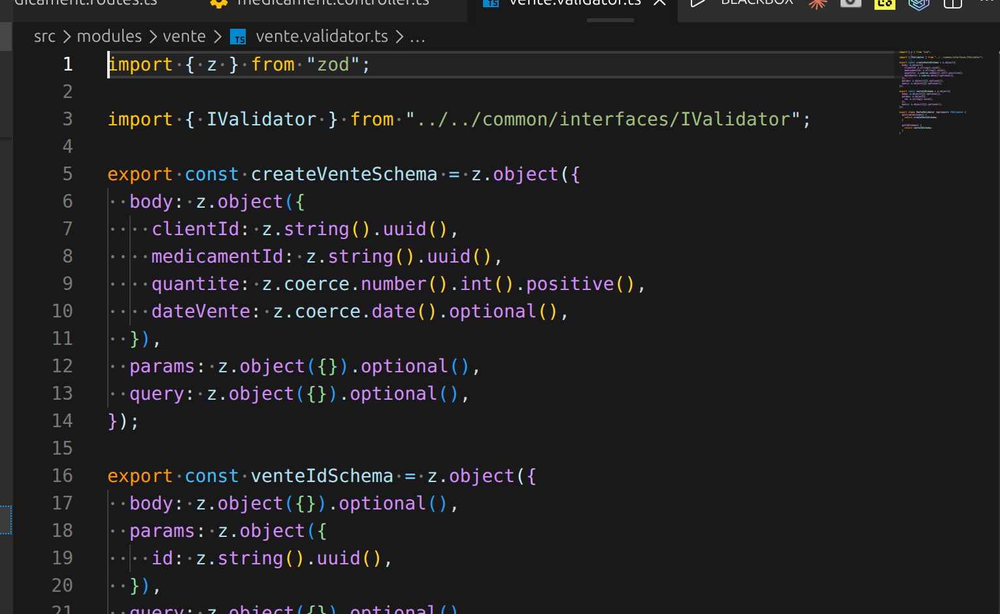{ width=100% }

### Étape 2. Déclarer les routes

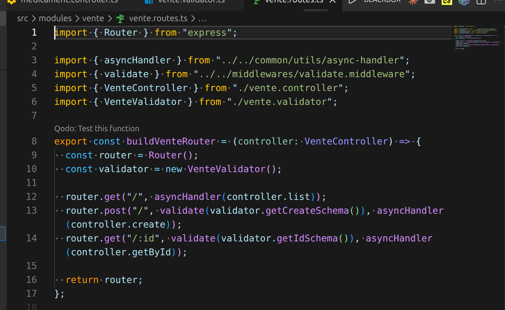{ width=100% }

Le routeur du module ventes est plus petit, mais cela ne signifie pas qu’il est plus simple. La vraie complexité se trouve dans le service.

### Étape 3. Construire le contrôleur

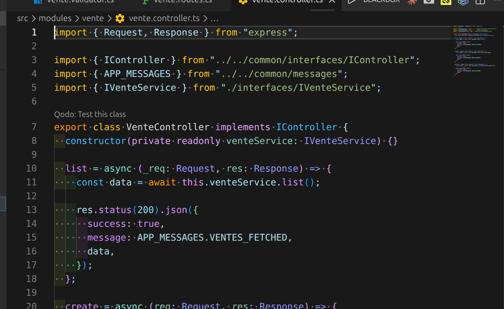{ width=100% }

Le contrôleur reçoit le résultat du service et le traduit en réponse exploitable.

### Étape 4. Écrire le service

Le service est ici le cœur de la décision métier.

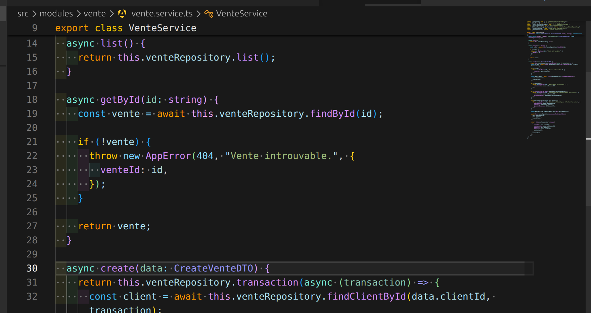{ width=100% }

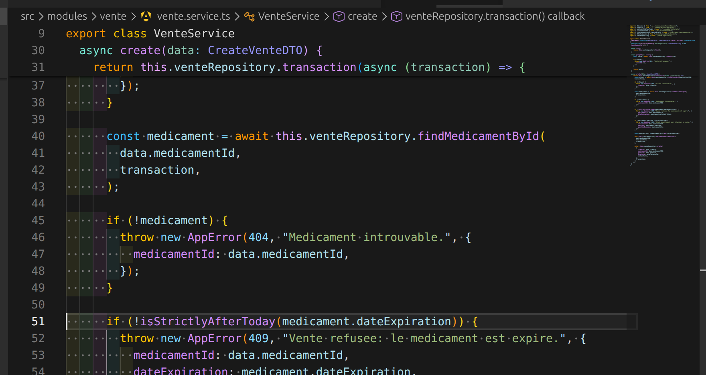{ width=100% }

Le service vérifie, dans cet ordre:

1. que le client existe;
2. que le médicament existe;
3. qu’il n’est pas expiré;
4. que le stock est suffisant;
5. que le montant total peut être calculé correctement.

### Étape 5. Écrire le repository

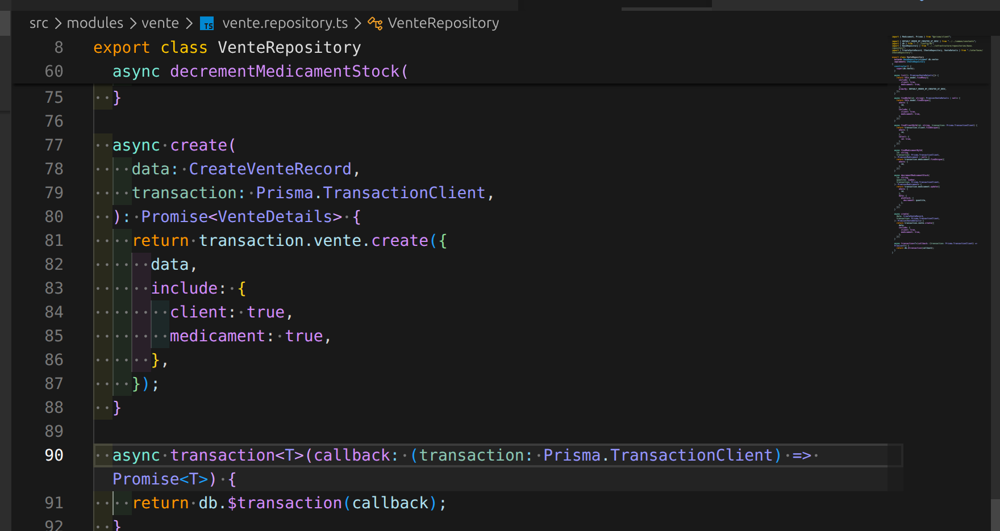{ width=100% }

La partie la plus importante est l’usage de `$transaction`. Cette instruction signifie que la création de la vente et la mise à jour du stock doivent réussir ensemble. Si l’une échoue, l’ensemble revient à l’état précédent.

### Étape 6. Assembler le module puis le raccorder au backend

Le container ventes relie enfin les dernières briques et renvoie un routeur opérationnel.

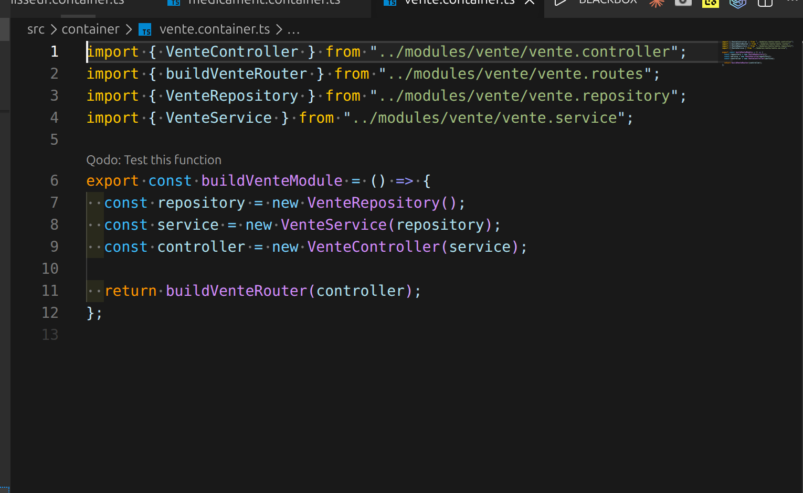{ width=100% }

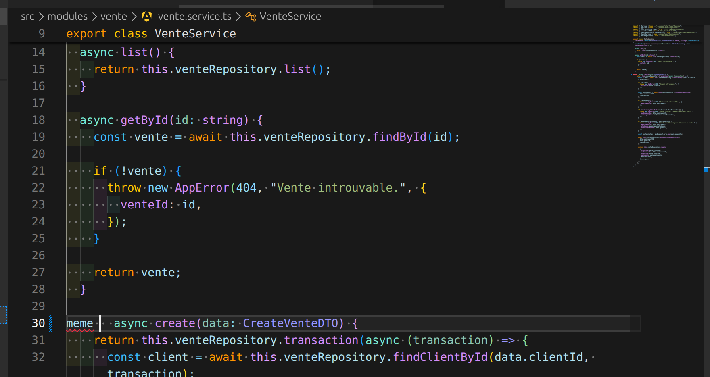{ width=100% }

Quand cette étape est terminée, le backend est capable d’exposer le module le plus sensible de l’application.

### Étape 7. Vérifier le module ventes dans Swagger

La vérification finale doit se faire avec une vraie entrée Swagger, car c’est elle qui prouve que la chaîne complète fonctionne jusqu’au contrat HTTP publié.

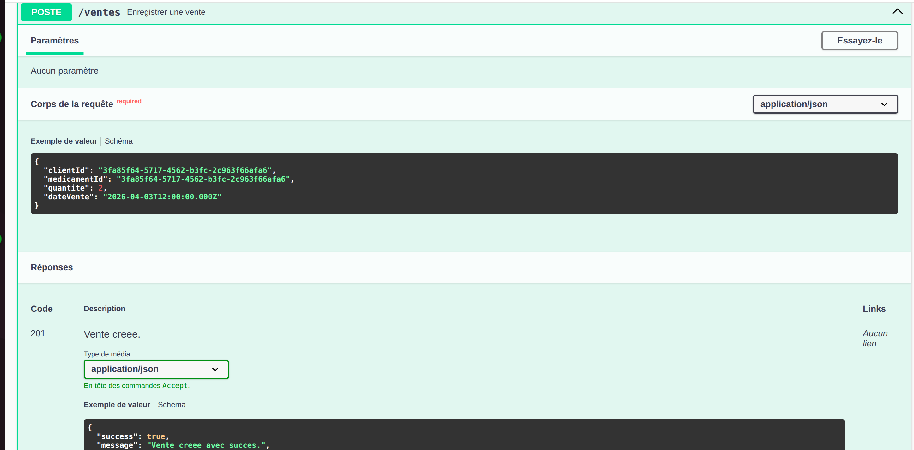{ width=100% }

Le test attendu suit cet ordre:

1. choisir un client existant;
2. choisir un médicament existant;
3. saisir une quantité réaliste;
4. envoyer la requête;
5. vérifier que la vente est créée et que le stock est décrémenté.

Ce module montre la maturité réelle du backend. Il ne fait pas une simple insertion de données. Il exécute une opération métier complète et contrôlée.

## Synthèse des responsabilités métier

| Module | Ce que le module veut accomplir | Ce que l’implémentation contrôle réellement |
|---|---|---|
| Auth | ouvrir une session technique | format de connexion, JWT, lecture de `/me` |
| Clients | gérer la base client | email unique, suppression protégée |
| Fournisseurs | gérer l’approvisionnement | code unique, suppression protégée |
| Médicaments | gérer le stock vendable | fournisseur valide, prix, stock, expiration |
| Ventes | enregistrer une sortie de stock | client, médicament, expiration, stock, transaction |

# Partie 4. Construction du modèle de données

## Ce que nous voulons construire

Avant de coder les routes et les services, il faut construire la base logique du projet. Dans `GesPharmacie`, cette base est le modèle de données. Il répond à une question simple: quelles informations la pharmacie doit-elle mémoriser pour fonctionner correctement?

La réponse retenue dans ce projet est la suivante:

- un `Client` représente la personne à qui la pharmacie vend un produit;
- un `Fournisseur` représente l’entreprise qui livre les médicaments;
- un `Medicament` représente un produit stocké et vendu;
- une `Vente` représente une sortie de stock liée à un client et à un médicament.

Si cette base est mal pensée, tout le reste devient fragile. C’est pour cette raison que la construction du modèle de données vient ici juste après l’étude des modules.

## Dépendances et commandes à connaître

Pour reconstruire cette partie depuis zéro, les dépendances principales sont:

- `@prisma/client` pour utiliser la base de données dans le code TypeScript;
- `prisma` pour décrire le schéma, générer le client et gérer les migrations;
- `postgresql` comme moteur de base de données.

Les commandes utiles sont:

- installation de la couche de données: `npm install @prisma/client`
- installation de l’outil Prisma: `npm install -D prisma`
- initialisation Prisma si on repart d’un projet vide: `npx prisma init`
- génération du client après modification du schéma: `npm run prisma:generate`
- création d’une migration en local: `npm run prisma:migrate`
- injection des données de démonstration: `npm run prisma:seed`

## Ordre conseillé pour reconstruire la base

1. lister les entités métier dont l’application a besoin;
2. définir les relations entre ces entités;
3. écrire le fichier `prisma/schema.prisma`;
4. générer le client Prisma;
5. créer puis appliquer les migrations;
6. écrire un `seed` pour obtenir des données de démonstration;
7. vérifier ensuite que les modules du backend lisent bien ces données.

Cet ordre est important. On ne commence pas par les services ou par Swagger. On commence par la structure qui va supporter toutes les opérations métier.

## Étape 1. Définir les tables, les relations et les contraintes

Le fichier principal de cette partie est `prisma/schema.prisma`. C’est lui qui dit à la fois:

- quelles tables existent;
- quels champs elles contiennent;
- quelles colonnes doivent rester uniques;
- quelles relations doivent être protégées.

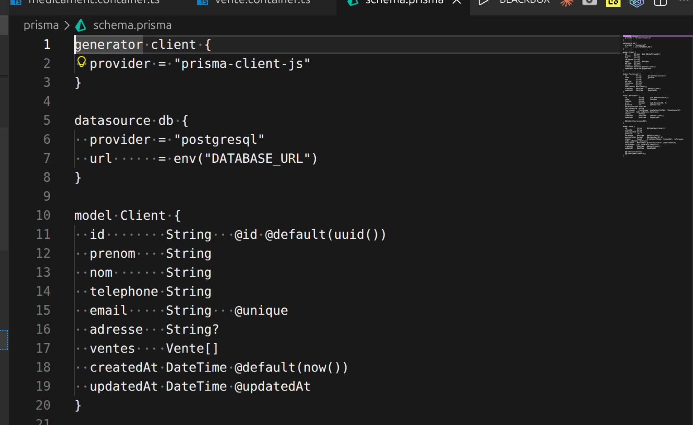{ width=100% }

Dans cette capture, on voit que le projet ne se contente pas de stocker des informations simples. Il impose aussi des règles:

- `Client.email` doit rester unique;
- `Fournisseur.code` doit rester unique;
- `Medicament.code` doit rester unique;
- les relations sensibles utilisent `onDelete: Restrict`.

Le choix `onDelete: Restrict` est particulièrement important. Il veut dire qu’on ne peut pas supprimer librement un élément encore utilisé ailleurs. Par exemple, on ne doit pas effacer un client si ce client apparaît déjà dans l’historique des ventes.

## Étape 2. Générer le client Prisma et les migrations

Une fois le schéma écrit, il ne suffit pas de le “regarder”. Il faut produire les outils qui permettront au backend de l’utiliser.

L’ordre correct est:

1. lancer `npm run prisma:generate` pour produire le client Prisma;
2. lancer `npm run prisma:migrate` pour créer et appliquer les migrations en local;
3. vérifier que la base contient bien les tables attendues.

Le rôle de cette étape est simple: transformer une description théorique en structure réellement exécutable par PostgreSQL et TypeScript.

## Étape 3. Préparer un jeu de données de démonstration

Une base vide est difficile à tester. C’est pour cela que le projet contient `prisma/seed.ts`.

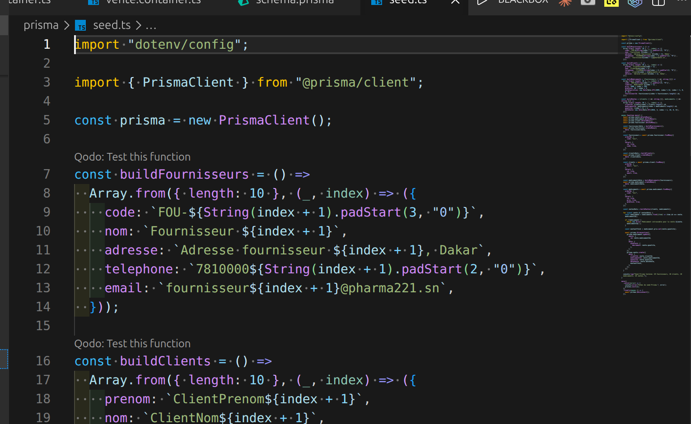{ width=100% }

Ce fichier sert à injecter un jeu de données cohérent pour la démonstration:

- des fournisseurs;
- des clients;
- des médicaments;
- des ventes.

Le point important est que ce `seed` ne dépose pas seulement des lignes “au hasard”. Il respecte aussi la logique métier, notamment la diminution du stock au moment où des ventes sont créées. Cela rend les démonstrations et les tests plus crédibles.

## Ce que fait chaque fichier de cette partie

| Fichier ou dossier | Rôle simple |
|---|---|
| `prisma/schema.prisma` | décrire les tables, les relations et les contraintes |
| `prisma/migrations/` | conserver l’historique de transformation de la base |
| `prisma/seed.ts` | remplir la base avec des données de départ cohérentes |
| `src/config/db.ts` | exposer l’accès à la connexion base de données |

Cette séparation est pédagogique. Un débutant comprend plus vite s’il sait exactement où regarder pour chaque responsabilité.

## Ce qu’il faut vérifier à la fin

Quand cette partie est terminée, il faut pouvoir répondre “oui” à ces questions:

- les quatre entités principales existent-elles bien?
- les relations entre clients, fournisseurs, médicaments et ventes sont-elles claires?
- les contraintes d’unicité empêchent-elles les doublons importants?
- le `seed` permet-il de tester l’application sans saisir toutes les données à la main?

Si la réponse est non, il faut corriger cette partie avant de revenir aux modules.

# Partie 5. Sécurité, validation et robustesse

## Ce que nous voulons protéger

Une application backend ne doit pas seulement fonctionner. Elle doit aussi refuser ce qui est faux, dangereux ou incohérent.

Dans `GesPharmacie`, cette protection repose sur cinq idées:

- vérifier les variables d’environnement dès le démarrage;
- valider les entrées HTTP avant la logique métier;
- vérifier les jetons JWT sur les routes protégées;
- centraliser la gestion des erreurs;
- journaliser ce qui se passe pour comprendre les incidents.

## Dépendances et commandes à connaître

Les dépendances les plus importantes de cette partie sont:

- `zod` pour la validation;
- `jsonwebtoken` pour les jetons JWT;
- `helmet` pour sécuriser les en-têtes HTTP;
- `cors` pour contrôler les échanges entre origines;
- `dotenv` pour charger les variables d’environnement;
- `pino` et `pino-pretty` pour la journalisation.

Commande minimale si on reconstruit cette partie dans un autre projet: `npm install zod jsonwebtoken helmet cors dotenv pino pino-pretty`.

## Ordre conseillé pour reconstruire la sécurité

1. définir les variables d’environnement obligatoires;
2. sécuriser la base Express avec `helmet`, `cors` et `express.json()`;
3. écrire le middleware de validation des requêtes;
4. écrire le middleware d’authentification JWT;
5. écrire le middleware de gestion d’erreurs;
6. brancher un logger;
7. tester les cas d’erreur avant même de penser à la production.

## Étape 1. Vérifier les variables d’environnement au démarrage

Avant de lancer le serveur, le projet vérifie que ses variables critiques existent et ont un format correct.

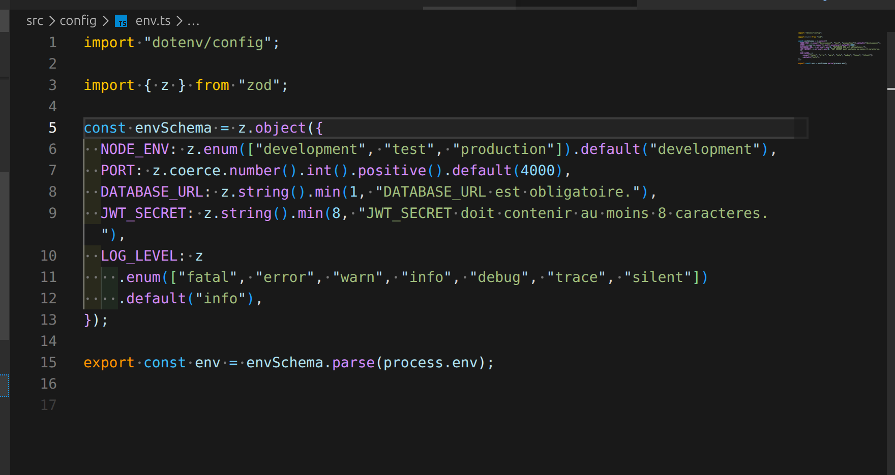{ width=100% }

Cette étape évite un problème fréquent chez les débutants: démarrer une API alors qu’il manque `DATABASE_URL` ou `JWT_SECRET`. Ici, si la configuration est invalide, l’application s’arrête immédiatement. C’est beaucoup plus sûr.

Les variables principales sont:

| Variable | Rôle |
|---|---|
| `NODE_ENV` | dire si l’application tourne en développement, test ou production |
| `PORT` | choisir le port d’écoute HTTP |
| `DATABASE_URL` | donner l’adresse de la base PostgreSQL |
| `JWT_SECRET` | signer et vérifier les jetons JWT |
| `LOG_LEVEL` | choisir le niveau de détail des logs |

## Étape 2. Contrôler les entrées HTTP

Quand une requête arrive, le backend ne doit pas la croire immédiatement. Il faut d’abord vérifier qu’elle contient les bons champs.

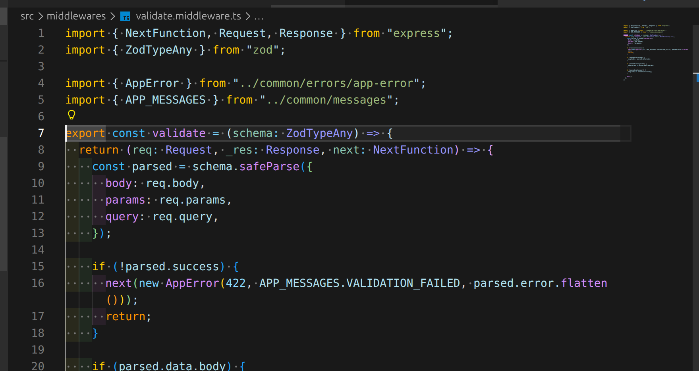{ width=100% }

Le rôle de `validate.middleware.ts` est très simple à comprendre: il lit `body`, `params` et `query`, puis il demande à Zod si la forme de la requête est correcte. Si ce n’est pas le cas, il bloque la route et transmet une erreur claire.

Cette étape protège les contrôleurs et les services. Sans elle, on transmettrait trop vite des données incomplètes ou mal typées au cœur métier.

## Étape 3. Vérifier les jetons JWT

Une fois la validation des données mise en place, il faut vérifier l’identité de l’appelant sur les routes qui exigent une authentification.

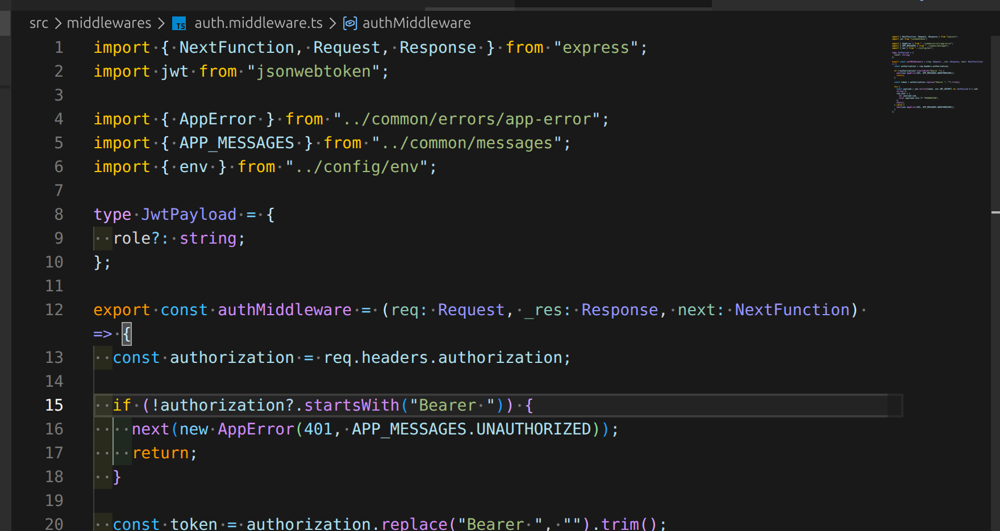{ width=100% }

Le middleware lit l’en-tête `Authorization`, vérifie qu’il commence bien par `Bearer`, puis tente de décoder le jeton avec `JWT_SECRET`. Si le jeton est correct, il ajoute `req.user` à la requête.

Il faut toutefois bien noter une limite actuelle du projet: à ce stade du code, la protection JWT est surtout utilisée pour `GET /auth/me`. Les autres modules métiers ne sont pas encore entièrement placés derrière ce filtre.

## Étape 4. Gérer les erreurs proprement

Quand un projet commence à grandir, il devient dangereux de laisser chaque route traiter ses erreurs à sa manière. Il faut une règle commune.

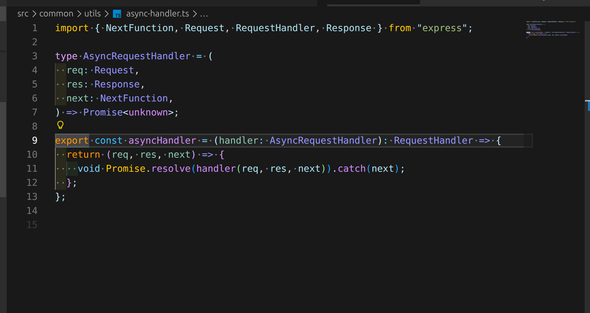{ width=100% }

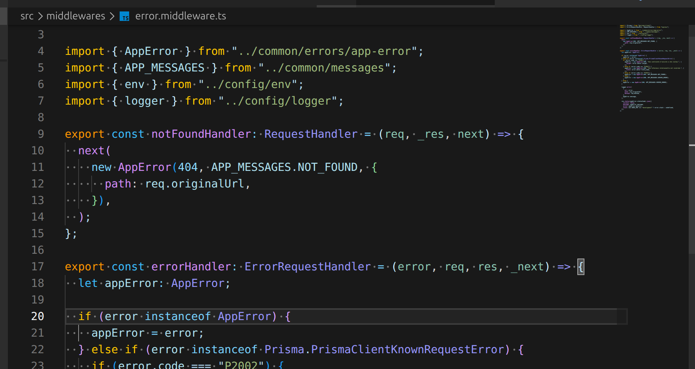{ width=100% }

Le fonctionnement devient alors plus simple:

1. une route déclenche une erreur;
2. l’erreur est transmise au pipeline Express;
3. le middleware `errorHandler` transforme cette erreur en réponse JSON homogène.

Ce système rend les retours beaucoup plus lisibles pour le frontend ou pour Swagger.

## Étape 5. Journaliser ce qui se passe

Une application sérieuse doit raconter ce qu’elle fait. C’est le rôle du logger.

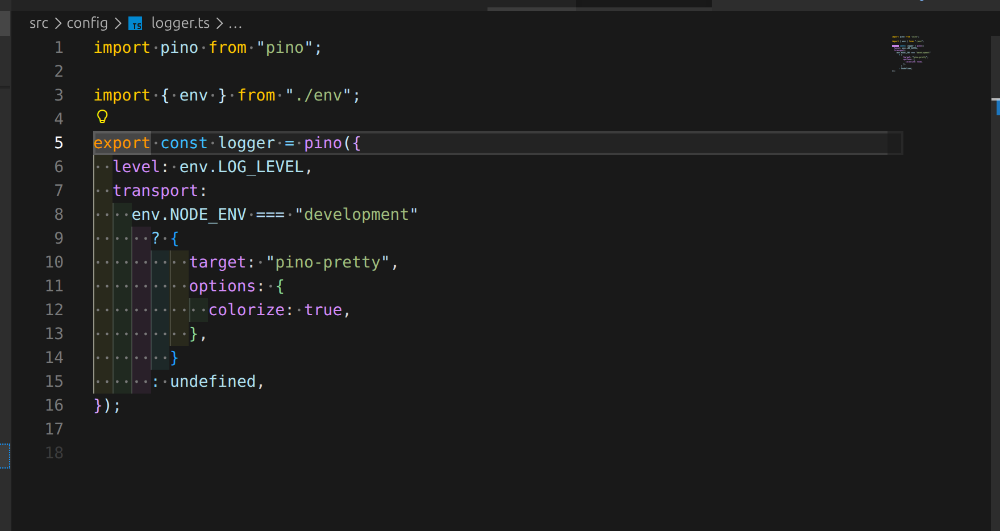{ width=100% }

En développement, `pino-pretty` rend les messages plus lisibles. En production, les logs restent structurés et donc plus faciles à exploiter dans un système d’observabilité.

## Ce qu’il faut retenir

Cette partie montre une idée importante: la sécurité n’est pas un seul fichier magique. C’est une chaîne.

- l’environnement doit être valide;
- la requête doit être propre;
- le jeton doit être fiable;
- l’erreur doit être explicable;
- le serveur doit laisser une trace compréhensible.

Si l’une de ces étapes manque, le backend devient beaucoup plus difficile à maintenir.

# Partie 6. Documentation d’API et observabilité

## Ce que nous voulons rendre visible

Quand le backend est construit, il faut encore le rendre compréhensible pour d’autres personnes. C’est le rôle de la documentation d’API.

Dans ce projet, cette partie doit permettre:

- de voir toutes les routes disponibles;
- de comprendre le format des entrées et des sorties;
- de tester les endpoints sans écrire de frontend;
- d’exposer en ligne le PDF du mémoire avec `/pdf`;
- de vérifier rapidement que le service répond avec `/api/v1/health`.

## Dépendances et commandes à connaître

Les éléments principaux sont:

- `swagger-ui-express` pour afficher Swagger UI;
- `@types/swagger-ui-express` pour le typage TypeScript;
- la route `/docs/openapi.json` pour exposer le contrat brut;
- la route `/pdf` pour afficher le mémoire directement dans le navigateur.

Commande minimale pour mettre en place Swagger dans un autre projet: `npm install swagger-ui-express @types/swagger-ui-express`.

## Ordre conseillé pour reconstruire cette partie

1. écrire le document OpenAPI;
2. exposer ce document en JSON;
3. brancher Swagger UI sur `/docs`;
4. brancher la route `/pdf`;
5. garder un endpoint de santé très simple;
6. vérifier ensuite toutes ces routes dans le navigateur.

## Étape 1. Décrire l’API dans OpenAPI

Le fichier `src/docs/openapi.ts` joue le rôle de contrat global.

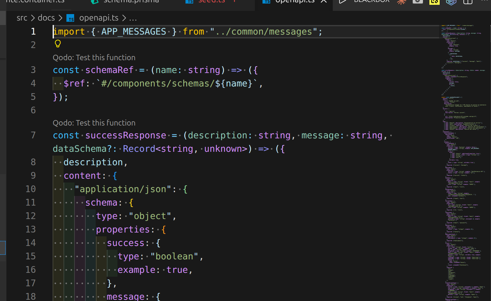{ width=100% }

Ce fichier dit:

- quel est le nom de l’API;
- quelles routes existent;
- quels objets sont attendus;
- quels schémas de sécurité sont disponibles;
- quels serveurs sont déclarés.

Une personne qui ne connaît pas le projet peut donc comprendre l’API sans lire tous les modules un par un.

## Étape 2. Publier Swagger UI

Une fois le contrat OpenAPI écrit, il faut l’exposer dans une interface que l’on peut utiliser directement.

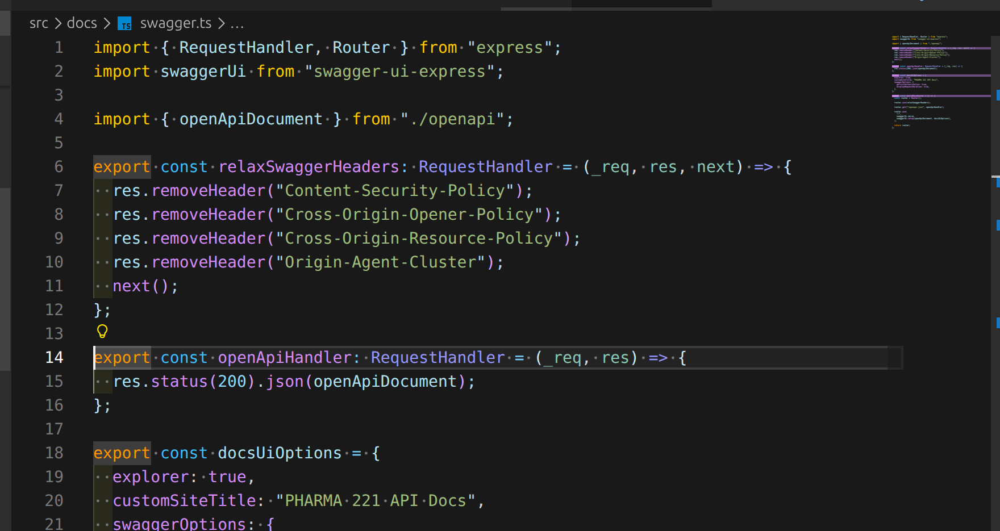{ width=100% }

Le rôle de `swagger.ts` est simple:

- servir `openapi.json`;
- préparer les options de Swagger UI;
- monter l’interface interactive sur `/docs`.

Cette étape est essentielle pour la soutenance. Elle transforme le backend en système montrable, testable et vérifiable.

## Étape 3. Publier le mémoire en ligne avec `/pdf`

Le projet ne s’arrête pas aux endpoints métier. Il publie aussi le mémoire directement sur le backend.

{ width=100% }

Le principe est facile à comprendre:

1. le backend cherche le fichier PDF du mémoire;
2. s’il le trouve, il renvoie ce PDF avec le bon `Content-Type`;
3. sinon, il renvoie une erreur `404` claire.

Cette idée est utile dans un contexte académique, car elle permet d’avoir le service et la documentation finale sur la même application.

## Étape 4. Vérifier les points d’accès publics

L’URL de publication communiquée pour ce projet est [https://pharmacie-221.onrender.com/](https://pharmacie-221.onrender.com/). À partir de cette base, les points d’accès importants sont:

| Point d’accès | Usage |
|---|---|
| [https://pharmacie-221.onrender.com/docs](https://pharmacie-221.onrender.com/docs) | interface Swagger |
| [https://pharmacie-221.onrender.com/docs/openapi.json](https://pharmacie-221.onrender.com/docs/openapi.json) | contrat OpenAPI brut |
| [https://pharmacie-221.onrender.com/api/v1/health](https://pharmacie-221.onrender.com/api/v1/health) | route de santé |
| [https://pharmacie-221.onrender.com/pdf](https://pharmacie-221.onrender.com/pdf) | mémoire en ligne |

Les captures conservées dans ce mémoire montrent la documentation Swagger du projet avec les principaux groupes d’endpoints.

{ width=100% }

{ width=100% }

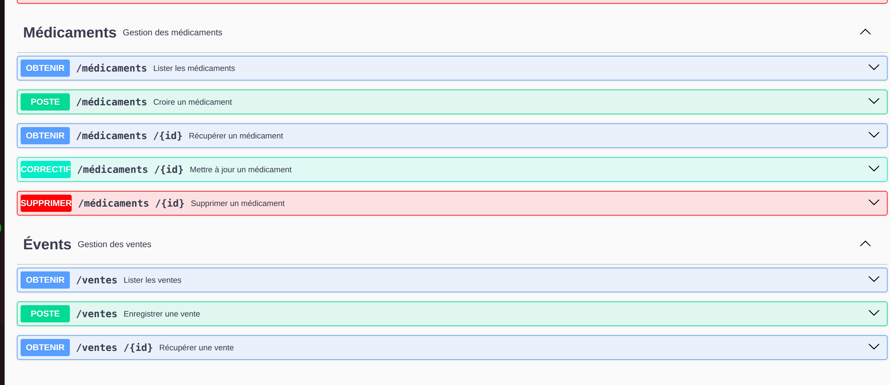{ width=100% }

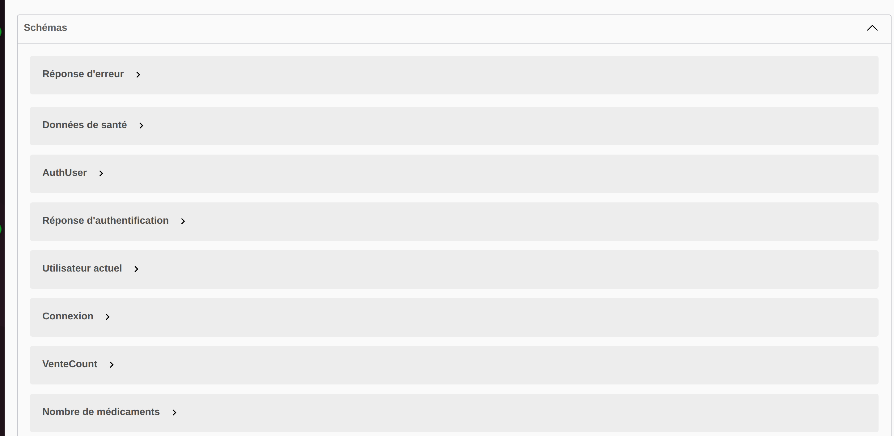{ width=100% }

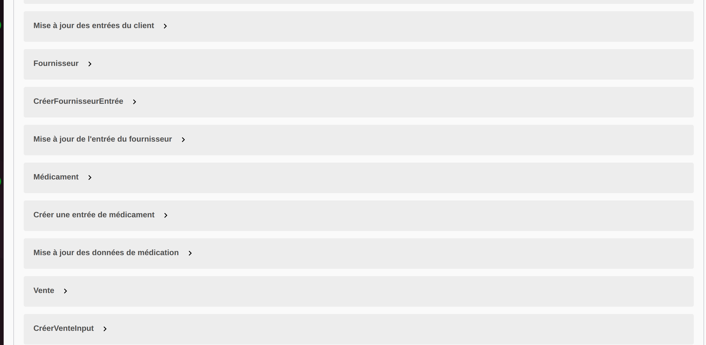{ width=100% }

## Ce qu’il faut retenir

Dans ce projet, l’observabilité reste volontairement simple, mais elle existe réellement:

- les logs aident à comprendre ce qui se passe;
- `/api/v1/health` confirme que le service répond;
- `/docs` rend le contrat visible;
- `/pdf` rend la documentation finale consultable en ligne.

Pour un projet académique, cette base est déjà très solide.

# Partie 7. Qualité logicielle, tests et intégration continue

## Ce que nous voulons sécuriser

Quand le backend commence à fonctionner, une nouvelle question apparaît: comment éviter de casser l’existant en ajoutant une nouvelle fonctionnalité?

La réponse du projet est double:

- écrire des tests unitaires autour des règles métier;
- automatiser la vérification dans GitHub Actions.

## Dépendances et commandes à connaître

Les outils principaux sont:

- `vitest` pour les tests;
- `supertest` pour tester le comportement HTTP;
- `@types/supertest` pour le typage.

Commandes importantes:

- installation: `npm install -D vitest supertest @types/supertest`
- exécution des tests: `npm run test`
- exécution en mode watch: `npm run test:watch`

## Ordre conseillé pour construire la qualité logicielle

1. choisir les scénarios les plus risqués;
2. écrire les tests unitaires sur les services;
3. vérifier la route de santé et la documentation;
4. lancer la suite localement;
5. automatiser cette vérification dans GitHub Actions;
6. ne déployer qu’après succès des tests.

## Étape 1. Écrire les tests autour des règles métier

Le dépôt contient un dossier `tests/unit` qui couvre:

- la santé générale de l’application;
- la documentation d’API;
- le service d’authentification;
- les services `client`, `fournisseur`, `medicament` et `vente`.

Le dossier `tests/integration` existe déjà, mais il est encore vide. Cela signifie que le projet a préparé l’emplacement pour la suite, même si l’effort principal est encore placé sur les tests unitaires.

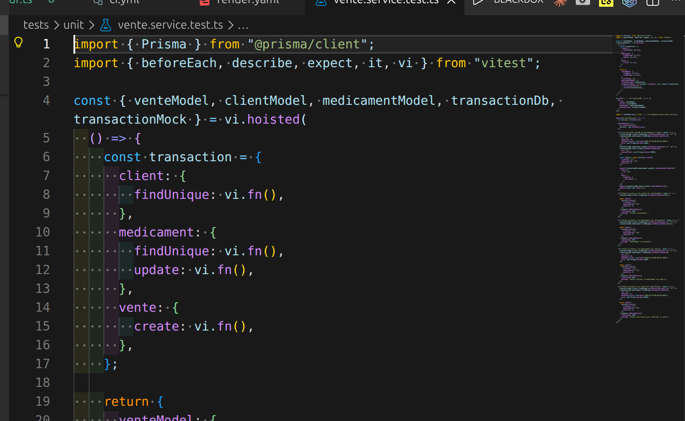{ width=100% }

Le module `vente` est un bon exemple, car c’est là que les règles métier sont les plus sensibles. Les tests y vérifient notamment:

- le cas nominal;
- le client introuvable;
- le médicament introuvable;
- le médicament expiré;
- le stock insuffisant.

## Étape 2. Exécuter la suite localement

Une fois les tests écrits, il faut lancer la suite complète avec `npm run test`.

Cette étape est indispensable. Un test non exécuté n’est pas une preuve. Il faut voir le résultat passer avant d’aller vers la CI.

## Étape 3. Automatiser la vérification dans GitHub Actions

Le workflow du dépôt reprend exactement la logique attendue dans une petite API professionnelle.

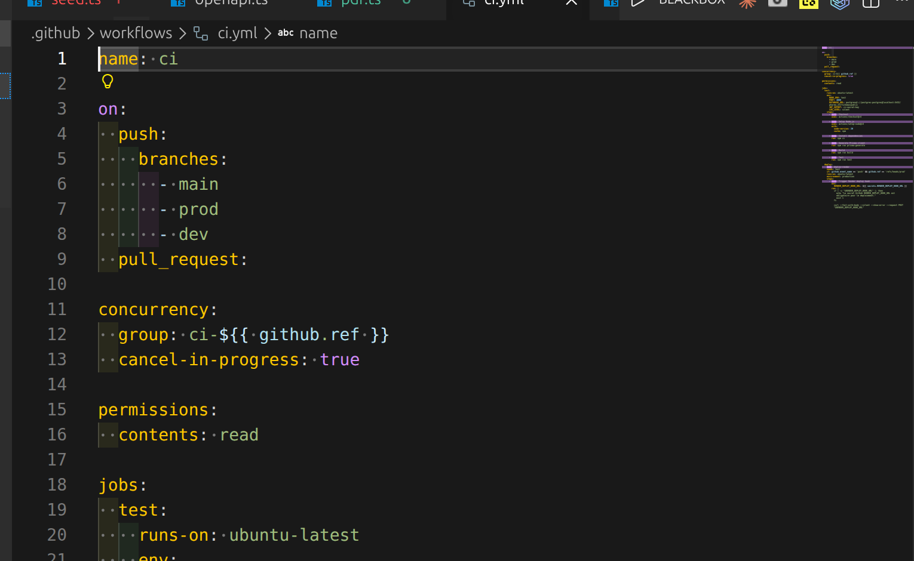{ width=100% }

Le job `test` installe les dépendances, génère le client Prisma, compile TypeScript puis lance les tests. Le job `deploy` n’intervient qu’après ce contrôle et seulement dans une condition bien précise.

## Étape 4. Comprendre la logique du pipeline

| Élément du pipeline | Ce qu’il fait |
|---|---|
| `push` sur `main`, `dev`, `prod` | déclenche la vérification |
| `pull_request` | contrôle les changements avant fusion |
| job `test` | installe, génère Prisma, build et teste |
| job `deploy` | déclenche Render uniquement après succès du job `test` |

Ce point est important pour un débutant: la CI n’est pas “magique”. Elle répète simplement, sur un serveur GitHub, les mêmes étapes qu’on devrait savoir exécuter localement.

## Ce qu’il faut retenir

La qualité logicielle du projet repose sur une idée très saine: avant de parler de production, on prouve d’abord que les règles métier les plus critiques se comportent comme prévu.

# Partie 8. Déploiement et exploitation

## Ce que nous voulons obtenir

Après avoir construit les modules, la base de données, la sécurité, la documentation et les tests, il reste une dernière étape technique: rendre le backend réellement exécutable.

Cette partie a deux objectifs:

- permettre un lancement local reproductible;
- permettre un déploiement public sur Render.

## Dépendances et commandes à connaître

Les commandes principales de cette étape sont:

- installation des dépendances: `npm ci`
- génération Prisma: `npm run prisma:generate`
- migration locale: `npm run prisma:migrate`
- seed local: `npm run prisma:seed`
- lancement local: `npm run dev`
- build de production: `npm run build`
- exécution Docker locale: `docker compose -f docker/docker-compose.yml up --build`

## Ordre conseillé pour passer du local à la production

1. préparer `.env`;
2. démarrer PostgreSQL en local ou avec Docker;
3. générer le client Prisma;
4. appliquer les migrations et injecter le seed;
5. démarrer le serveur local;
6. construire le build TypeScript;
7. décrire le service Render;
8. vérifier la santé de l’API et la documentation après publication.

## Étape 1. Vérifier les scripts et le démarrage local

Le fichier `package.json` contient les scripts qui structurent tout le cycle de vie du backend.

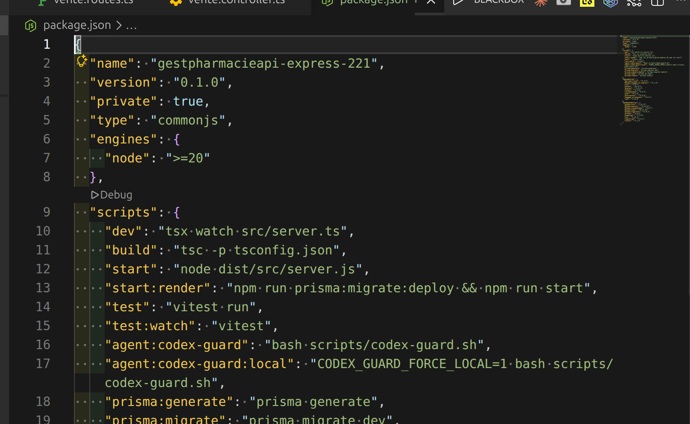{ width=100% }

Ensuite, `src/server.ts` orchestre le vrai démarrage:

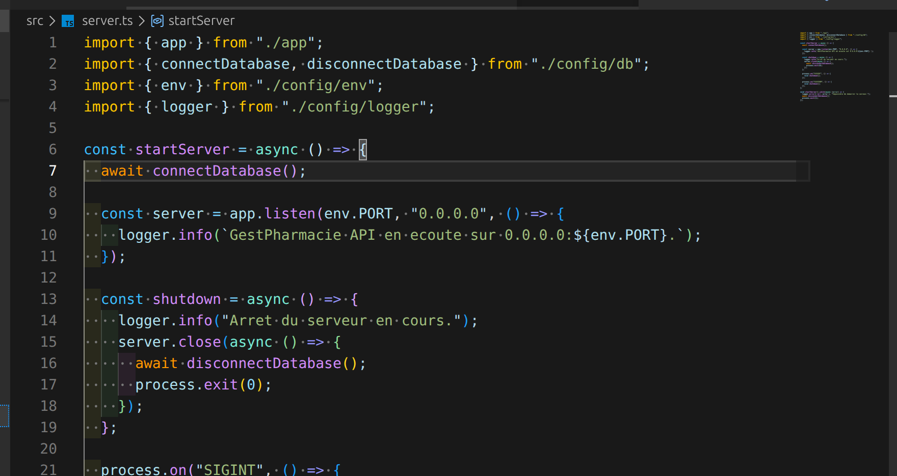{ width=100% }

Cette séparation est bonne à retenir:

- `package.json` dit quelles commandes lancer;
- `server.ts` dit comment démarrer réellement l’API;
- `app.ts` assemble les middlewares et les routes.

## Étape 2. Préparer l’exécution locale avec Docker

Le projet propose aussi une exécution locale plus structurée grâce à Docker.

Le fichier `docker/docker-compose.yml` sert à lancer:

- l’API;
- la base PostgreSQL locale.

Le fichier `docker/Dockerfile` sert à construire une image Node.js capable de builder puis d’exécuter l’application. Cette option est utile pour reproduire un environnement proche de la production.

## Étape 3. Décrire la production dans `render.yaml`

Une fois le projet stable en local, il faut décrire à la plateforme comment le construire et comment le lancer.

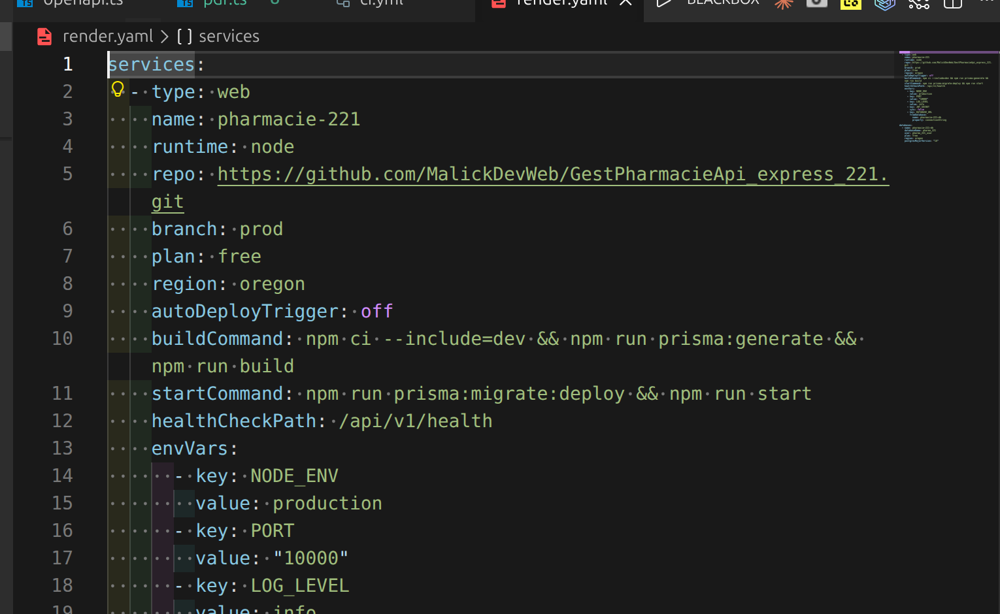{ width=100% }

Ce fichier indique notamment:

- le nom du service;
- la branche de déploiement `prod`;
- la commande de build;
- la commande de démarrage;
- la route de santé `/api/v1/health`;
- la base de données PostgreSQL associée.

Le point pédagogique à retenir est le suivant: un déploiement sérieux n’est pas fait “à la main” à chaque fois. Il est décrit dans un fichier reproductible.

## Ce que fait chaque fichier de déploiement

| Fichier | Rôle simple |
|---|---|
| `package.json` | expose les commandes de build, test, seed et démarrage |
| `src/server.ts` | connecte la base puis démarre l’API |
| `docker/docker-compose.yml` | lance l’API et PostgreSQL en local |
| `docker/Dockerfile` | construit une image exécutable du backend |
| `render.yaml` | décrit le service publié sur Render |

## Ce qu’il faut vérifier à la fin

Quand le backend est déployé, il faut vérifier au minimum:

- que la route de santé répond;
- que Swagger est visible;
- que le PDF du mémoire peut s’ouvrir via `/pdf`;
- que les modules métier sont présents dans `/docs`;
- que la configuration Render correspond bien à la branche `prod`.

# Partie 9. Démonstration technique backend

## Comment démontrer le projet dans le bon ordre

Une démonstration technique réussie ne consiste pas à cliquer au hasard. Il faut suivre un ordre logique pour que même une personne non développeuse comprenne ce qui se passe.

L’ordre conseillé pour présenter ce backend est:

1. montrer d’abord l’objectif général du projet;
2. ouvrir Swagger pour faire voir les modules disponibles;
3. tester l’authentification;
4. tester un fournisseur;
5. tester un médicament;
6. tester un client;
7. tester une vente;
8. montrer ensuite la route `/health`;
9. terminer par `/pdf` pour présenter le mémoire en ligne.

## Les points d’accès utiles pour la soutenance

| Point d’accès public | Rôle dans la démonstration |
|---|---|
| [https://pharmacie-221.onrender.com/](https://pharmacie-221.onrender.com/) | base du backend |
| [https://pharmacie-221.onrender.com/docs](https://pharmacie-221.onrender.com/docs) | porte d’entrée principale de la démonstration |
| [https://pharmacie-221.onrender.com/docs/openapi.json](https://pharmacie-221.onrender.com/docs/openapi.json) | preuve du contrat machine-readable |
| [https://pharmacie-221.onrender.com/api/v1/health](https://pharmacie-221.onrender.com/api/v1/health) | preuve minimale que le service répond |
| [https://pharmacie-221.onrender.com/pdf](https://pharmacie-221.onrender.com/pdf) | mémoire consultable en ligne |

## Étape 1. Montrer la documentation interactive

La première chose à montrer à un jury ou à un correcteur est l’interface Swagger, car elle résume visuellement le périmètre du backend.

{ width=100% }

Cette vue prouve qu’on peut déjà interagir avec le module `fournisseurs`.

## Étape 2. Enchaîner avec les médicaments

Une fois le fournisseur compris, on peut passer au module `medicaments`, car il dépend directement de cette entité.

{ width=100% }

Le lecteur voit alors que la progression est logique:

- on crée d’abord la source d’approvisionnement;
- ensuite on crée le produit qui sera vendu.

## Étape 3. Terminer par la vente

La vente est la meilleure preuve fonctionnelle du backend, car elle mobilise plusieurs modules à la fois.

{ width=100% }

Quand cette route fonctionne, cela signifie qu’un grand nombre d’éléments ont déjà été correctement mis en place:

- le client existe;
- le médicament existe;
- le stock est suffisant;
- le produit n’est pas expiré;
- la transaction métier est cohérente.

## Ce que prouve réellement cette démonstration

Cette démonstration technique ne montre pas seulement “des routes qui répondent”. Elle prouve en réalité quatre choses:

- le backend est structuré et documenté;
- la base de données supporte correctement le domaine;
- les règles métier importantes sont codées;
- le projet peut être présenté en ligne de manière professionnelle.

Pour une soutenance, cette logique est beaucoup plus forte qu’une simple liste de fichiers ou qu’une description trop abstraite.

# Limites actuelles et perspectives

## Limites identifiées

L’analyse du code met en évidence plusieurs limites importantes:

1. L’authentification ne repose pas encore sur une table d’utilisateurs persistante.
2. La vérification du mot de passe n’est pas implémentée contre une base réelle.
3. La protection JWT ne couvre actuellement que la route `/auth/me`.
4. La suite de tests est essentiellement unitaire; les tests d’intégration HTTP et base de données restent à développer.
5. Le périmètre métier est centré sur les entités principales, sans gestion avancée des rôles, de l’audit ou des statistiques.

## Perspectives d’évolution

Les évolutions prioritaires les plus cohérentes seraient les suivantes:

- introduire une table `User` avec mot de passe haché;
- protéger toutes les routes métier sensibles par JWT;
- ajouter une autorisation par rôle (`ADMIN`, `PHARMACIEN`, `CAISSIER`);
- enrichir les ventes avec une historisation plus détaillée;
- introduire des tests d’intégration sur base PostgreSQL éphémère;
- compléter l’observabilité en production.

Ces perspectives prolongent naturellement l’architecture actuelle. Elles ne remettent pas en cause les fondations choisies; elles les renforcent.

# Conclusion générale

Le backend GesPharmacie présente une base de travail sérieuse, cohérente et bien structurée. Son architecture modulaire permet de distinguer clairement le transport HTTP, la logique métier et la persistance. Les décisions les plus solides du projet résident dans:

- la structuration régulière des modules;
- la centralisation des validations;
- la protection de l’intégrité métier;
- l’usage de Prisma pour formaliser les relations;
- la présence d’une documentation OpenAPI et d’une CI exécutable;
- la mise en place d’une logique transactionnelle sur la vente.

Le projet n’est pas encore un backend pleinement industrialisé. L’authentification et la couverture sécuritaire doivent être renforcées. Néanmoins, du point de vue académique et logiciel, la solution démontre déjà une compréhension correcte des principes d’architecture, de qualité et de modélisation nécessaires à un système de gestion de pharmacie.

En ce sens, ce backend constitue une base crédible pour une soutenance technique: il montre non seulement ce qui a été codé, mais aussi la logique qui a guidé les choix d’implémentation.

# Annexes techniques

## Annexe A. Variables et configuration

| Élément | Valeur ou rôle |
|---|---|
| Runtime cible | Node.js `>=20` |
| Langage | TypeScript |
| ORM | Prisma |
| Base de données | PostgreSQL |
| Documentation | Swagger UI + OpenAPI 3.0.3 |
| Logger | Pino |
| Tests | Vitest |
| Déploiement | Render |
| URL backend publiée | [Instance Render](https://pharmacie-221.onrender.com/) |
| Exécution locale conteneurisée | Docker Compose |

## Annexe B. Extraits de preuves d’exécution

- Build backend exécuté avec succès via `npm run build`.
- Tests backend exécutés avec succès via `npm test`.
- Workflow CI analysé dans `.github/workflows/ci.yml`.
- Schéma relationnel analysé dans `prisma/schema.prisma`.
- Documentation d’API analysée dans `src/docs/openapi.ts` et `src/docs/swagger.ts`.
